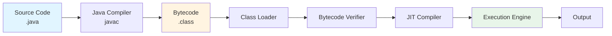
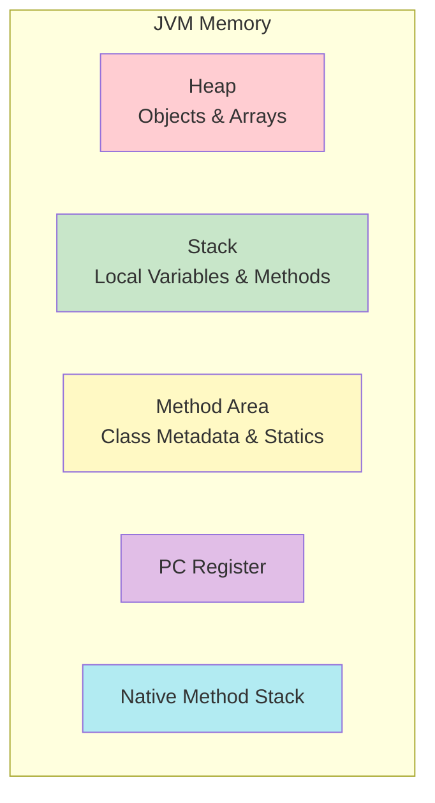
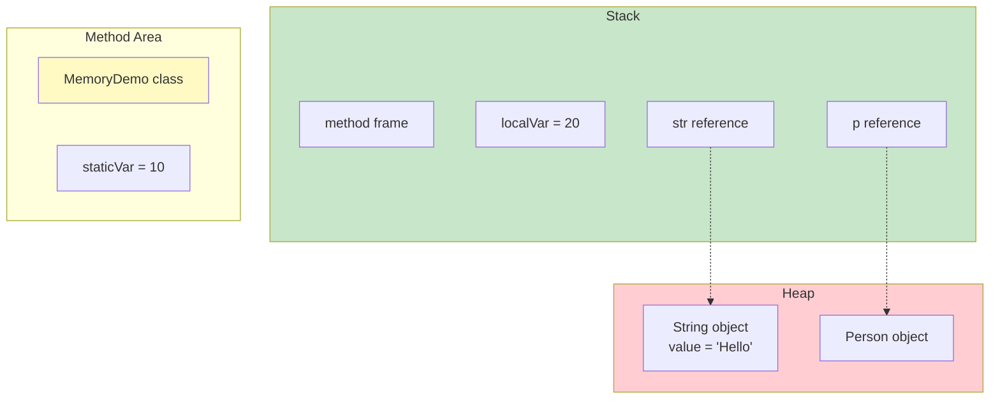
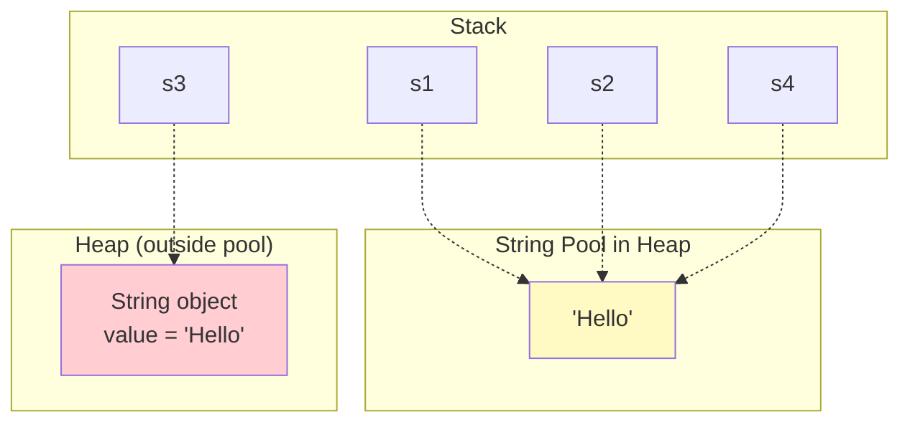
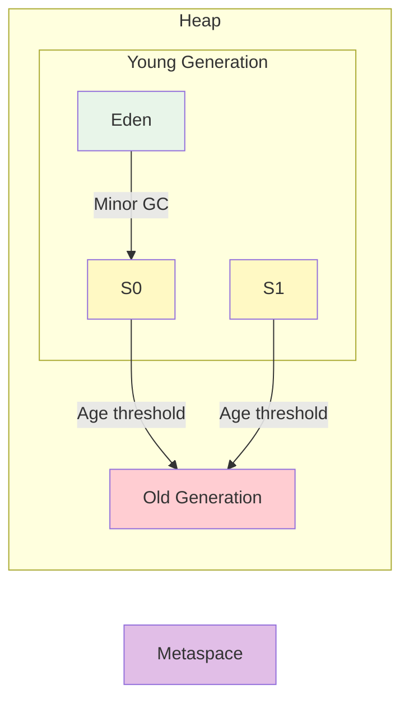
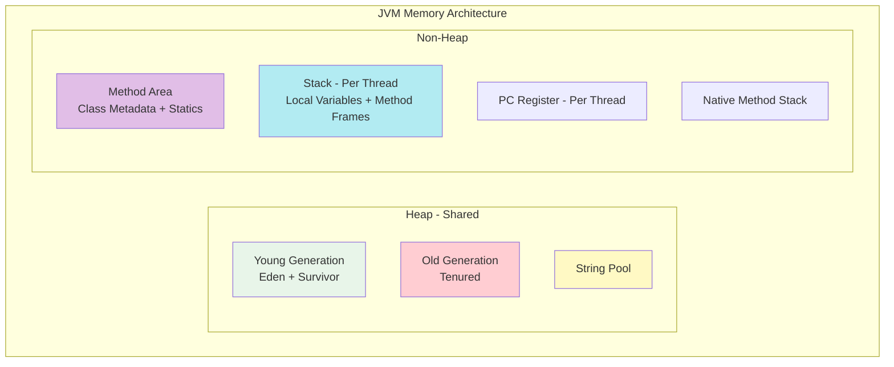

# Java Basics - Complete Syntax & Fundamentals Guide

## Phase 1: Concept Foundation

### 1.1 What is Java?

**Java** is a high-level, class-based, object-oriented programming language designed to have as few implementation dependencies as possible. It follows the principle of **WORA (Write Once, Run Anywhere)**.

**Why it exists:**
- Platform independence through JVM (Java Virtual Machine)
- Memory management through automatic garbage collection
- Strong type system to catch errors at compile time
- Rich standard library ecosystem

**Problems it solves:**
- Cross-platform compatibility
- Memory leaks (via garbage collection)
- Pointer-related errors
- Complex memory management

### 1.2 Core Principles

1. **Platform Independence** - Bytecode runs on any JVM
2. **Object-Oriented** - Everything is an object (except primitives)
3. **Strongly Typed** - Type checking at compile time
4. **Automatic Memory Management** - Garbage collector handles deallocation
5. **Secure** - No explicit pointers, runtime security checks

### 1.3 Real-World Analogy

Think of Java as a **universal translator device**:
- You write your message once (Java source code)
- It gets converted to a universal language (bytecode)
- Any device with the translator (JVM) can understand it
- The translator also protects you from making dangerous mistakes (type safety, memory management)

---

## Phase 2: Language Implementation

### 2.1 Java Program Structure

```java
// Single-line comment

/*
 * Multi-line comment
 */

/**
 * Documentation comment (Javadoc)
 * @author Your Name
 */

package com.example.basics;  // Package declaration (optional, must be first)

import java.util.*;          // Import statements

public class HelloWorld {     // Class declaration (must match filename)
    
    // Class variables (static)
    static int classVar = 10;
    
    // Instance variables
    int instanceVar;
    
    // Constructor
    public HelloWorld() {
        instanceVar = 20;
    }
    
    // main method - entry point
    public static void main(String[] args) {
        System.out.println("Hello, World!");
    }
    
    // Instance method
    public void display() {
        System.out.println("Instance: " + instanceVar);
    }
}
```

**Key Rules:**
- File name must match public class name
- Only one public class per file
- Package declaration must be first (if present)
- Import statements come after package
- `main()` method signature must be exact: `public static void main(String[] args)`

---

### 2.2 Data Types

#### Primitive Types (8 types)

| Type | Size | Range | Default Value | Example |
|------|------|-------|---------------|---------|
| `byte` | 1 byte | -128 to 127 | 0 | `byte b = 100;` |
| `short` | 2 bytes | -32,768 to 32,767 | 0 | `short s = 1000;` |
| `int` | 4 bytes | -2³¹ to 2³¹-1 | 0 | `int i = 100000;` |
| `long` | 8 bytes | -2⁶³ to 2⁶³-1 | 0L | `long l = 100000L;` |
| `float` | 4 bytes | ~6-7 decimal digits | 0.0f | `float f = 10.5f;` |
| `double` | 8 bytes | ~15 decimal digits | 0.0d | `double d = 10.5;` |
| `char` | 2 bytes | 0 to 65,535 (Unicode) | '\u0000' | `char c = 'A';` |
| `boolean` | ~1 bit | true/false | false | `boolean b = true;` |

```java
// Primitive examples
int age = 25;
double salary = 50000.50;
char grade = 'A';
boolean isActive = true;

// Literals
int decimal = 100;
int hex = 0x64;        // Hexadecimal
int binary = 0b1100100; // Binary (Java 7+)
int withUnderscore = 1_000_000; // Java 7+ for readability

float pi = 3.14f;      // 'f' suffix required
double e = 2.718;      // default for floating point
long big = 100L;       // 'L' suffix recommended

char letter = 'A';
char unicode = '\u0041'; // Unicode for 'A'
```

#### Reference Types

```java
// String (most commonly used reference type)
String name = "Java";
String empty = "";
String nullStr = null;

// Arrays
int[] numbers = {1, 2, 3, 4, 5};
int[] nums = new int[5];
String[] names = new String[10];

// Objects
Object obj = new Object();
Integer boxedInt = 100; // Wrapper class
```

---

### 2.3 Variables

#### Variable Types

```java
public class VariableTypes {
    
    // 1. Instance variables (non-static fields)
    int instanceVar = 10;
    private String name;
    
    // 2. Class variables (static fields)
    static int classVar = 20;
    static final double PI = 3.14159; // Constant
    
    // 3. Local variables (method scope)
    public void method() {
        int localVar = 30;  // Must be initialized before use
        System.out.println(localVar);
    }
    
    // 4. Parameters
    public void process(int param) {
        // param is a local variable
    }
}
```

**Variable Naming Rules:**
- Must start with letter, `$`, or `_`
- Cannot use reserved keywords
- Case-sensitive
- Convention: camelCase for variables, UPPER_SNAKE_CASE for constants

```java
// Valid names
int age;
int _count;
int $price;
int age2;

// Invalid names
// int 2age;     // Cannot start with digit
// int class;    // Reserved keyword
// int my-var;   // Hyphen not allowed
```

---

### 2.4 Operators

#### Arithmetic Operators

```java
int a = 10, b = 3;

int sum = a + b;        // 13
int diff = a - b;       // 7
int product = a * b;    // 30
int quotient = a / b;   // 3 (integer division)
int remainder = a % b;  // 1

double divDouble = 10.0 / 3; // 3.333...

// Unary
int x = 5;
int y = -x;   // -5
int z = +x;   // 5
```

#### Increment/Decrement

```java
int i = 5;

// Post-increment (use then increment)
int a = i++;  // a = 5, i = 6

// Pre-increment (increment then use)
int b = ++i;  // b = 7, i = 7

// Post-decrement
int c = i--;  // c = 7, i = 6

// Pre-decrement
int d = --i;  // d = 5, i = 5
```

#### Relational Operators

```java
int a = 10, b = 20;

boolean result;
result = a == b;  // false (equal to)
result = a != b;  // true (not equal to)
result = a > b;   // false
result = a < b;   // true
result = a >= b;  // false
result = a <= b;  // true
```

#### Logical Operators

```java
boolean x = true, y = false;

boolean and = x && y;  // false (short-circuit AND)
boolean or = x || y;   // true (short-circuit OR)
boolean not = !x;      // false

// Non-short-circuit (always evaluates both)
boolean andBit = x & y;
boolean orBit = x | y;
```

#### Bitwise Operators

```java
int a = 5;  // 0101
int b = 3;  // 0011

int andResult = a & b;   // 0001 = 1
int orResult = a | b;    // 0111 = 7
int xorResult = a ^ b;   // 0110 = 6
int notResult = ~a;      // 1010 (two's complement)

int leftShift = a << 1;  // 1010 = 10
int rightShift = a >> 1; // 0010 = 2
int unsignedRight = a >>> 1; // 0010 = 2
```

#### Assignment Operators

```java
int x = 10;

x += 5;  // x = x + 5  -> 15
x -= 3;  // x = x - 3  -> 12
x *= 2;  // x = x * 2  -> 24
x /= 4;  // x = x / 4  -> 6
x %= 4;  // x = x % 4  -> 2

x &= 3;  // Bitwise AND assignment
x |= 1;  // Bitwise OR assignment
x ^= 2;  // Bitwise XOR assignment
x <<= 2; // Left shift assignment
x >>= 1; // Right shift assignment
```

#### Ternary Operator

```java
int a = 10, b = 20;

int max = (a > b) ? a : b;  // max = 20

String result = (a % 2 == 0) ? "Even" : "Odd";

// Nested ternary (use sparingly)
int grade = 85;
String result = (grade >= 90) ? "A" :
                (grade >= 80) ? "B" :
                (grade >= 70) ? "C" : "F";
```

#### Operator Precedence

```java
int result = 10 + 5 * 2;  // 20 (not 30)

// From highest to lowest:
// 1. Postfix: expr++ expr--
// 2. Unary: ++expr --expr +expr -expr ! ~
// 3. Multiplicative: * / %
// 4. Additive: + -
// 5. Shift: << >> >>>
// 6. Relational: < > <= >= instanceof
// 7. Equality: == !=
// 8. Bitwise AND: &
// 9. Bitwise XOR: ^
// 10. Bitwise OR: |
// 11. Logical AND: &&
// 12. Logical OR: ||
// 13. Ternary: ? :
// 14. Assignment: = += -= *= /= %= &= ^= |= <<= >>= >>>=
```

---

### 2.5 Control Flow Statements

#### if-else

```java
int score = 75;

// Simple if
if (score >= 60) {
    System.out.println("Pass");
}

// if-else
if (score >= 60) {
    System.out.println("Pass");
} else {
    System.out.println("Fail");
}

// if-else-if ladder
if (score >= 90) {
    System.out.println("A");
} else if (score >= 80) {
    System.out.println("B");
} else if (score >= 70) {
    System.out.println("C");
} else if (score >= 60) {
    System.out.println("D");
} else {
    System.out.println("F");
}

// Nested if
if (score >= 60) {
    if (score >= 90) {
        System.out.println("Excellent!");
    }
}
```

#### switch

```java
// Traditional switch (Java 7+: String support)
int day = 3;

switch (day) {
    case 1:
        System.out.println("Monday");
        break;
    case 2:
        System.out.println("Tuesday");
        break;
    case 3:
        System.out.println("Wednesday");
        break;
    default:
        System.out.println("Other day");
        break;
}

// Fall-through behavior
switch (day) {
    case 1:
    case 2:
    case 3:
    case 4:
    case 5:
        System.out.println("Weekday");
        break;
    case 6:
    case 7:
        System.out.println("Weekend");
        break;
}

// Switch with String (Java 7+)
String color = "RED";
switch (color) {
    case "RED":
        System.out.println("Stop");
        break;
    case "GREEN":
        System.out.println("Go");
        break;
}

// Switch expression (Java 14+)
String result = switch (day) {
    case 1, 2, 3, 4, 5 -> "Weekday";
    case 6, 7 -> "Weekend";
    default -> "Invalid";
};
```

#### Loops

**while Loop**

```java
int i = 0;
while (i < 5) {
    System.out.println(i);
    i++;
}

// Infinite loop
while (true) {
    // break to exit
}
```

**do-while Loop**

```java
int i = 0;
do {
    System.out.println(i);
    i++;
} while (i < 5);

// Executes at least once
int j = 10;
do {
    System.out.println("Executed");
} while (j < 5); // Still prints "Executed"
```

**for Loop**

```java
// Standard for
for (int i = 0; i < 5; i++) {
    System.out.println(i);
}

// Multiple variables
for (int i = 0, j = 10; i < j; i++, j--) {
    System.out.println(i + " " + j);
}

// Infinite loop
for (;;) {
    // break to exit
}

// Enhanced for (for-each) - Java 5+
int[] numbers = {1, 2, 3, 4, 5};
for (int num : numbers) {
    System.out.println(num);
}

String[] names = {"Alice", "Bob", "Charlie"};
for (String name : names) {
    System.out.println(name);
}
```

#### Break and Continue

```java
// break - exits loop
for (int i = 0; i < 10; i++) {
    if (i == 5) {
        break;  // Exit loop when i is 5
    }
    System.out.println(i); // Prints 0-4
}

// continue - skips current iteration
for (int i = 0; i < 10; i++) {
    if (i % 2 == 0) {
        continue;  // Skip even numbers
    }
    System.out.println(i); // Prints 1,3,5,7,9
}

// Labeled break and continue
outer: for (int i = 0; i < 3; i++) {
    for (int j = 0; j < 3; j++) {
        if (i == 1 && j == 1) {
            break outer;  // Breaks out of both loops
        }
        System.out.println(i + "," + j);
    }
}
```

---

### 2.6 Arrays

#### Declaration and Initialization

```java
// Declaration
int[] arr1;              // Preferred
int arr2[];              // Also valid (C-style)

// Initialization
int[] numbers = new int[5];           // Default values (0)
int[] nums = {1, 2, 3, 4, 5};        // Array initializer
int[] values = new int[]{1, 2, 3};   // Explicit initialization

// Accessing elements
numbers[0] = 10;
int first = numbers[0];
int length = numbers.length; // Property (not method)

// Multi-dimensional arrays
int[][] matrix = new int[3][4];      // 3 rows, 4 columns
int[][] grid = {
    {1, 2, 3},
    {4, 5, 6},
    {7, 8, 9}
};

// Jagged arrays (arrays of arrays)
int[][] jagged = new int[3][];
jagged[0] = new int[2];
jagged[1] = new int[4];
jagged[2] = new int[3];

// Accessing 2D arrays
matrix[0][0] = 1;
int value = grid[1][2]; // 6
```

#### Array Operations

```java
import java.util.Arrays;

int[] arr = {5, 2, 8, 1, 9};

// Sorting
Arrays.sort(arr);  // [1, 2, 5, 8, 9]

// Searching (binary search - array must be sorted)
int index = Arrays.binarySearch(arr, 5); // 2

// Copying
int[] copy1 = Arrays.copyOf(arr, arr.length);
int[] copy2 = arr.clone();

// Filling
int[] filled = new int[5];
Arrays.fill(filled, 10); // [10, 10, 10, 10, 10]

// Comparing
boolean equal = Arrays.equals(arr, copy1);

// Converting to String
String str = Arrays.toString(arr);

// Iteration
for (int i = 0; i < arr.length; i++) {
    System.out.println(arr[i]);
}

// Enhanced for
for (int num : arr) {
    System.out.println(num);
}
```

---

### 2.7 Strings

#### String Basics

```java
// String creation
String s1 = "Hello";           // String literal (string pool)
String s2 = new String("Hello"); // Heap object
String s3 = "Hello";           // Reuses s1 from pool

// String comparison
boolean same = (s1 == s3);     // true (same reference)
boolean equal = s1.equals(s2); // true (same content)

// String is immutable
String original = "Hello";
original.concat(" World");     // Returns new string
System.out.println(original);  // Still "Hello"

String modified = original.concat(" World");
System.out.println(modified);  // "Hello World"
```

#### String Methods

```java
String str = "Hello World";

// Length
int len = str.length(); // 11

// Character access
char ch = str.charAt(0);        // 'H'
char last = str.charAt(str.length() - 1); // 'd'

// Substring
String sub1 = str.substring(0, 5);  // "Hello"
String sub2 = str.substring(6);     // "World"

// Case conversion
String upper = str.toUpperCase();   // "HELLO WORLD"
String lower = str.toLowerCase();   // "hello world"

// Trim (removes leading/trailing whitespace)
String padded = "  Hello  ";
String trimmed = padded.trim();     // "Hello"

// Replace
String replaced = str.replace('o', '0'); // "Hell0 W0rld"
String replaceAll = str.replaceAll("World", "Java"); // "Hello Java"

// Split
String csv = "apple,banana,orange";
String[] fruits = csv.split(",");   // ["apple", "banana", "orange"]

// Contains, startsWith, endsWith
boolean contains = str.contains("World");     // true
boolean starts = str.startsWith("Hello");     // true
boolean ends = str.endsWith("World");         // true

// Index methods
int index = str.indexOf('o');           // 4 (first occurrence)
int lastIndex = str.lastIndexOf('o');   // 7 (last occurrence)
int notFound = str.indexOf('z');        // -1

// Comparison
int compare = str.compareTo("Hello");   // Positive (lexicographic)
boolean equalsIgnore = str.equalsIgnoreCase("hello world"); // true

// Empty check
String empty = "";
boolean isEmpty = empty.isEmpty();      // true
boolean isBlank = empty.isBlank();      // true (Java 11+)
```

#### StringBuilder and StringBuffer

```java
// StringBuilder (not thread-safe, faster)
StringBuilder sb = new StringBuilder();
sb.append("Hello");
sb.append(" ");
sb.append("World");
String result = sb.toString(); // "Hello World"

// Chaining
String chained = new StringBuilder()
    .append("Java")
    .append(" ")
    .append("Programming")
    .toString();

// Other methods
sb.insert(5, ",");        // Insert at position
sb.delete(5, 6);          // Delete range
sb.reverse();             // Reverse string
sb.setCharAt(0, 'h');    // Modify character

// StringBuffer (thread-safe, slower)
StringBuffer sbf = new StringBuffer();
sbf.append("Thread-safe");
```

**When to use:**
- **String**: Immutable, use when content doesn't change
- **StringBuilder**: Mutable, use for string manipulation (single-threaded)
- **StringBuffer**: Mutable, thread-safe (multi-threaded)

---

### 2.8 Type Conversion

#### Implicit (Widening)

```java
// Automatic conversion (no data loss)
byte b = 10;
short s = b;    // byte -> short
int i = s;      // short -> int
long l = i;     // int -> long
float f = l;    // long -> float
double d = f;   // float -> double

// Order: byte -> short -> int -> long -> float -> double
```

#### Explicit (Narrowing)

```java
// Manual casting (potential data loss)
double d = 100.5;
long l = (long) d;      // 100
int i = (int) l;        // 100
short s = (short) i;    // 100
byte b = (byte) s;      // 100

// Overflow example
int big = 130;
byte small = (byte) big; // -126 (overflow)
```

#### Wrapper Classes

```java
// Primitive to Wrapper (Boxing)
int primitive = 10;
Integer wrapper = Integer.valueOf(primitive);  // Explicit
Integer auto = primitive;                      // Autoboxing (Java 5+)

// Wrapper to Primitive (Unboxing)
Integer wrapperObj = 20;
int primitiveVal = wrapperObj.intValue();     // Explicit
int autoVal = wrapperObj;                     // Auto-unboxing

// All wrapper classes
Byte bWrapper = 10;
Short sWrapper = 100;
Integer iWrapper = 1000;
Long lWrapper = 10000L;
Float fWrapper = 10.5f;
Double dWrapper = 10.5;
Character cWrapper = 'A';
Boolean boolWrapper = true;

// Useful methods
int parsed = Integer.parseInt("123");         // String to int
String str = Integer.toString(123);           // int to String
String binary = Integer.toBinaryString(10);   // "1010"
String hex = Integer.toHexString(255);        // "ff"

// Comparing wrappers
Integer a = 100;
Integer b = 100;
System.out.println(a == b);        // true (cached -128 to 127)

Integer c = 200;
Integer d = 200;
System.out.println(c == d);        // false (different objects)
System.out.println(c.equals(d));   // true (value comparison)
```

---

### 2.9 Input/Output

#### Console Output

```java
// println - with newline
System.out.println("Hello");
System.out.println(123);

// print - without newline
System.out.print("Hello ");
System.out.print("World");

// printf - formatted output
int age = 25;
double price = 19.99;
System.out.printf("Age: %d, Price: %.2f%n", age, price);

// Format specifiers:
// %d - integer
// %f - floating point
// %s - string
// %c - character
// %b - boolean
// %n - newline (platform independent)
```

#### Console Input (Scanner)

```java
import java.util.Scanner;

Scanner scanner = new Scanner(System.in);

// Reading different types
System.out.print("Enter name: ");
String name = scanner.nextLine();      // Reads entire line

System.out.print("Enter age: ");
int age = scanner.nextInt();           // Reads integer

System.out.print("Enter salary: ");
double salary = scanner.nextDouble();  // Reads double

System.out.print("Enter grade: ");
char grade = scanner.next().charAt(0); // Reads character

// Important: nextInt(), nextDouble() etc. don't consume newline
// Use scanner.nextLine() after them to consume the newline

scanner.nextInt();
scanner.nextLine(); // Consume leftover newline

// Closing scanner
scanner.close();
```

---

### 2.10 Methods

#### Method Declaration

```java
public class Methods {
    
    // Method syntax:
    // accessModifier returnType methodName(parameters) {
    //     // method body
    // }
    
    // No parameters, no return
    public void greet() {
        System.out.println("Hello!");
    }
    
    // With parameters, with return
    public int add(int a, int b) {
        return a + b;
    }
    
    // Multiple parameters
    public double calculateArea(double length, double width) {
        return length * width;
    }
    
    // Return type can be any type
    public String getName() {
        return "Java";
    }
    
    public int[] getArray() {
        return new int[]{1, 2, 3};
    }
}
```

#### Method Overloading

```java
public class Calculator {
    
    // Same method name, different parameters
    public int add(int a, int b) {
        return a + b;
    }
    
    public double add(double a, double b) {
        return a + b;
    }
    
    public int add(int a, int b, int c) {
        return a + b + c;
    }
    
    // Different parameter order
    public void display(int x, String str) {
        System.out.println(x + " " + str);
    }
    
    public void display(String str, int x) {
        System.out.println(str + " " + x);
    }
}

// Usage
Calculator calc = new Calculator();
calc.add(5, 10);        // Calls int version
calc.add(5.5, 10.5);    // Calls double version
```

#### Variable Arguments (Varargs)

```java
// Accepts variable number of arguments
public int sum(int... numbers) {
    int total = 0;
    for (int num : numbers) {
        total += num;
    }
    return total;
}

// Usage
sum(1, 2);          // 3
sum(1, 2, 3);       // 6
sum(1, 2, 3, 4, 5); // 15

// Varargs must be last parameter
public void display(String name, int... scores) {
    System.out.print(name + ": ");
    for (int score : scores) {
        System.out.print(score + " ");
    }
}
```

#### Pass by Value

```java
// Java is ALWAYS pass-by-value

// Primitives - copy of value
public void changePrimitive(int x) {
    x = 100;  // Changes local copy only
}

int num = 10;
changePrimitive(num);
System.out.println(num); // Still 10

// Objects - copy of reference
public void changeReference(int[] arr) {
    arr[0] = 100;  // Modifies original array
}

int[] array = {1, 2, 3};
changeReference(array);
System.out.println(array[0]); // 100

// Reassigning reference doesn't affect original
public void reassignReference(int[] arr) {
    arr = new int[]{10, 20, 30};  // Local reference changes
}

int[] original = {1, 2, 3};
reassignReference(original);
System.out.println(original[0]); // Still 1
```

---

### 2.11 Access Modifiers

| Modifier | Same Class | Same Package | Subclass (different package) | Different Package |
|----------|-----------|--------------|----------------------------|-------------------|
| `private` | ✓ | ✗ | ✗ | ✗ |
| default (package-private) | ✓ | ✓ | ✗ | ✗ |
| `protected` | ✓ | ✓ | ✓ | ✗ |
| `public` | ✓ | ✓ | ✓ | ✓ |

```java
public class AccessModifiers {
    
    private int privateVar = 10;        // Only within class
    int defaultVar = 20;                // Within package
    protected int protectedVar = 30;    // Within package + subclasses
    public int publicVar = 40;          // Everywhere
    
    private void privateMethod() { }
    void defaultMethod() { }
    protected void protectedMethod() { }
    public void publicMethod() { }
}
```

---

### 2.12 Keywords

#### final

```java
// final variable - constant
final int MAX_SIZE = 100;
// MAX_SIZE = 200; // Compile error

// final method - cannot be overridden
class Parent {
    public final void display() {
        System.out.println("Final method");
    }
}

class Child extends Parent {
    // Cannot override display()
}

// final class - cannot be extended
final class FinalClass {
    // ...
}

// class CannotExtend extends FinalClass { } // Compile error

// final with objects - reference is constant
final int[] arr = {1, 2, 3};
arr[0] = 10;           // OK - modifying content
// arr = new int[5];   // Error - cannot reassign reference
```

#### static

```java
public class StaticDemo {
    
    // static variable - shared by all instances
    static int count = 0;
    
    // instance variable - each instance has own copy
    int id;
    
    // Constructor
    public StaticDemo() {
        count++;
        id = count;
    }
    
    // static method - called on class, not instance
    public static void displayCount() {
        System.out.println("Count: " + count);
        // Cannot access instance variables
        // System.out.println(id); // Error
    }
    
    // instance method - can access both static and instance
    public void display() {
        System.out.println("ID: " + id + ", Count: " + count);
    }
    
    // static block - runs once when class is loaded
    static {
        System.out.println("Static block executed");
        count = 10;
    }
}

// Usage
StaticDemo obj1 = new StaticDemo(); // count = 11
StaticDemo obj2 = new StaticDemo(); // count = 12
StaticDemo.displayCount();          // Accessed via class name
```

#### this

```java
public class ThisDemo {
    private int x;
    
    // this refers to current instance
    public ThisDemo(int x) {
        this.x = x; // Differentiate parameter from instance variable
    }
    
    // Calling another constructor
    public ThisDemo() {
        this(0); // Calls ThisDemo(int x)
    }
    
    // Returning current instance
    public ThisDemo setX(int x) {
        this.x = x;
        return this; // Method chaining
    }
    
    // Passing current instance as parameter
    public void process() {
        helper(this);
    }
    
    private void helper(ThisDemo obj) {
        // ...
    }
}
```

---

### 2.2 C++ Comparison

#### Key Differences Summary

| Feature | Java | C++ |
|---------|------|-----|
| **Memory Management** | Automatic (GC) | Manual (new/delete) |
| **Pointers** | No explicit pointers | Full pointer support |
| **Multiple Inheritance** | No (interfaces only) | Yes |
| **Operator Overloading** | No | Yes |
| **Default Access** | Package-private | Private |
| **goto** | Reserved but not used | Available |
| **Preprocessor** | No | Yes (#include, #define) |
| **Templates vs Generics** | Type erasure | Template instantiation |
| **Object Model** | All objects on heap | Objects on stack/heap |
| **Header Files** | No | Yes (.h files) |
| **Destructors** | finalize() (deprecated) | ~ClassName() |
| **Pass by Reference** | Not available | Available (int&) |

#### Code Examples

**Hello World Comparison**

```cpp
// C++
#include <iostream>
using namespace std;

int main() {
    cout << "Hello, World!" << endl;
    return 0;
}

// Java
public class HelloWorld {
    public static void main(String[] args) {
        System.out.println("Hello, World!");
    }
}
```

**Memory Management**

```cpp
// C++ - Manual memory management
int* ptr = new int(10);
delete ptr; // Must manually free

int* arr = new int[5];
delete[] arr; // Array deletion

// Java - Automatic garbage collection
Integer obj = new Integer(10);
// No manual deletion needed

int[] arr = new int[5];
// GC handles cleanup
```

**Pass by Reference**

```cpp
// C++ - True pass by reference
void swap(int& a, int& b) {
    int temp = a;
    a = b;
    b = temp;
}

int x = 10, y = 20;
swap(x, y); // x=20, y=10
```

```java
// Java - Pass by value always
void swap(Integer a, Integer b) {
    Integer temp = a;
    a = b;
    b = temp; // Doesn't affect original
}

// Java workaround - use arrays or objects
void swap(int[] arr) {
    int temp = arr[0];
    arr[0] = arr[1];
    arr[1] = temp;
}
```

---

## Phase 3: Internal Mechanics

### 3.1 Java Compilation and Execution Process

**Compile Time:**
1. Source code (`.java`) written by developer
2. Java Compiler (`javac`) checks syntax and semantics
3. Bytecode (`.class`) generated - platform-independent intermediate code
4. Type checking, method resolution (for known types)

**Runtime:**
1. Class Loader loads `.class` files into memory
2. Bytecode Verifier ensures code safety
3. JIT (Just-In-Time) Compiler converts bytecode to native machine code
4. Execution Engine runs the machine code
5. Garbage Collector manages memory automatically

**Key Points:**
- **Write Once, Run Anywhere (WORA)**: Bytecode runs on any JVM
- **JVM** (Java Virtual Machine): Platform-specific runtime environment
- **JRE** (Java Runtime Environment): JVM + libraries
- **JDK** (Java Development Kit): JRE + development tools (javac, debugger)



---

### 3.2 Memory Model

Java divides memory into several areas:

**1. Heap**
- Stores all objects and instance variables
- Shared among all threads
- Garbage collected
- Size configurable: `-Xmx` (max), `-Xms` (initial)

**2. Stack**
- Stores local variables and method call frames
- Each thread has its own stack
- LIFO (Last In First Out)
- Automatically managed (no GC needed)
- Size configurable: `-Xss`

**3. Method Area (Metaspace in Java 8+)**
- Stores class metadata, static variables, constant pool
- Shared among all threads

**4. PC Register**
- Stores address of current instruction
- Each thread has its own

**5. Native Method Stack**
- For native (non-Java) method calls



**Example:**

```java
public class MemoryDemo {
    static int staticVar = 10;    // Method Area
    
    public void method() {
        int localVar = 20;        // Stack
        String str = new String("Hello"); // "str" on Stack, object on Heap
        
        Person p = new Person();  // "p" reference on Stack, object on Heap
    }
}
```



---

### 3.3 String Pool Internals

Java maintains a **String Pool** (also called String Constant Pool) in heap memory to optimize memory usage for String literals.

**How it works:**

```java
String s1 = "Hello";        // Created in String Pool
String s2 = "Hello";        // Reuses s1 from pool
String s3 = new String("Hello"); // Creates new object in Heap

System.out.println(s1 == s2);    // true (same reference)
System.out.println(s1 == s3);    // false (different objects)
System.out.println(s1.equals(s3)); // true (same content)

// intern() method - adds to pool if not present
String s4 = s3.intern();    // Returns reference from pool
System.out.println(s1 == s4);    // true
```



**Why String is Immutable:**
1. **Security**: Sensitive data (passwords, connection strings) remains unchanged
2. **Thread Safety**: Multiple threads can share without synchronization
3. **Caching**: Hash code can be cached (used in HashMap)
4. **String Pool**: Enables pool optimization

---

### 3.4 Garbage Collection

**What is Garbage Collection?**
Automatic memory management that reclaims memory from objects no longer in use.

**How it works:**
1. **Mark Phase**: Identifies live (reachable) objects starting from GC roots
2. **Sweep Phase**: Removes unreachable objects
3. **Compact Phase** (optional): Defragments memory

**GC Roots:**
- Local variables in active methods
- Static variables
- Active threads
- JNI references

**Generational Garbage Collection:**

Java divides heap into generations based on object lifespan:

1. **Young Generation**
   - Eden Space: New objects created here
   - Survivor Spaces (S0, S1): Objects that survive minor GC
   - Minor GC: Frequent, fast collection in young generation

2. **Old Generation (Tenured)**
   - Long-lived objects promoted from young generation
   - Major GC (Full GC): Less frequent, slower

3. **Metaspace** (Java 8+)
   - Class metadata



**Making Objects Eligible for GC:**

```java
// 1. Nullifying reference
Object obj = new Object();
obj = null; // Now eligible

// 2. Reassigning reference
Object obj1 = new Object();
obj1 = new Object(); // First object eligible

// 3. Object created inside method
public void method() {
    Object obj = new Object();
} // obj eligible after method returns

// 4. Island of isolation
class Node {
    Node next;
}

Node n1 = new Node();
Node n2 = new Node();
n1.next = n2;
n2.next = n1;

n1 = null;
n2 = null; // Both eligible (circular reference doesn't prevent GC)
```

**finalize() method** (Deprecated in Java 9):
```java
@Override
protected void finalize() throws Throwable {
    // Called before GC (not guaranteed)
    // Don't use - use try-with-resources or cleaner API
}
```

**Request GC:**
```java
System.gc();         // Request (not force) GC
Runtime.getRuntime().gc();
```

---

### 3.5 Autoboxing/Unboxing Internals

**Autoboxing**: Automatic conversion of primitive to wrapper object
**Unboxing**: Automatic conversion of wrapper object to primitive

```java
// Autoboxing - compiler adds Integer.valueOf()
Integer obj = 10; 
// Actually: Integer obj = Integer.valueOf(10);

// Unboxing - compiler adds intValue()
int primitive = obj;
// Actually: int primitive = obj.intValue();

// In expressions
Integer a = 10;
Integer b = 20;
int sum = a + b;  // Both unboxed before addition
```

**Integer Cache:**
Java caches Integer objects for values -128 to 127 for performance:

```java
Integer a = 127;
Integer b = 127;
System.out.println(a == b); // true (same cached object)

Integer c = 128;
Integer d = 128;
System.out.println(c == d); // false (different objects)

// Always use equals() for wrapper comparison
System.out.println(c.equals(d)); // true
```

**Performance Consideration:**
```java
// Bad - boxing/unboxing in loop
Integer sum = 0;
for (int i = 0; i < 1000; i++) {
    sum += i; // Unbox, add, box in each iteration
}

// Good - use primitives
int sum = 0;
for (int i = 0; i < 1000; i++) {
    sum += i;
}
```

---

## Phase 4: Practical Design Perspective

### 4.1 Design Implications

#### Choosing Between Primitive and Wrapper
- **Use primitives when:**
  - Performance is critical
  - Simple arithmetic operations
  - No need for null values
  - Large arrays (memory efficiency)

- **Use wrappers when:**
  - Working with Collections (cannot store primitives)
  - Need null to represent absence of value
  - Need utility methods (Integer.parseInt(), etc.)
  - Required by APIs (generics)

#### String Immutability Benefits
- **Thread-safe** without synchronization
- **Secure** for sensitive data
- **Cacheable** hash codes
- **Enables String Pool** optimization

**But:**
- Creates new objects on every modification
- Use StringBuilder/StringBuffer for heavy string manipulation

#### Static vs Instance
- **Use static when:**
  - Shared state across all instances (counter, configuration)
  - Utility methods (Math.max(), Collections.sort())
  - Factory methods
  - Constants

- **Use instance when:**
  - Object-specific state
  - Behavior varies per object
  - Need polymorphism

#### Access Modifiers Strategy
- **Default to private** - encapsulation
- **Use protected** for inheritance-based extension
- **Use public** only for intended API
- **Avoid public fields** - use getters/setters

---

### 4.2 Common Mistakes & Pitfalls

#### 1. == vs equals() for Objects

```java
// ❌ Wrong
String s1 = new String("Hello");
String s2 = new String("Hello");
if (s1 == s2) { } // false - compares references

// ✅ Correct
if (s1.equals(s2)) { } // true - compares content
```

#### 2. Integer Caching Trap

```java
// ❌ Confusing
Integer a = 127;
Integer b = 127;
System.out.println(a == b); // true (cached)

Integer c = 128;
Integer d = 128;
System.out.println(c == d); // false (not cached)

// ✅ Always use equals()
System.out.println(c.equals(d)); // true
```

#### 3. Array Index Out of Bounds

```java
int[] arr = new int[5];

// ❌ Wrong
for (int i = 0; i <= arr.length; i++) { // <= causes error
    System.out.println(arr[i]);
}

// ✅ Correct
for (int i = 0; i < arr.length; i++) {
    System.out.println(arr[i]);
}
```

#### 4. String Concatenation in Loops

```java
// ❌ Inefficient - creates many String objects
String result = "";
for (int i = 0; i < 1000; i++) {
    result += i; // New String object each iteration
}

// ✅ Efficient
StringBuilder sb = new StringBuilder();
for (int i = 0; i < 1000; i++) {
    sb.append(i);
}
String result = sb.toString();
```

#### 5. Floating Point Precision

```java
// ❌ Don't use == for floating point
double d1 = 0.1 + 0.2;
if (d1 == 0.3) { } // false (0.30000000000000004)

// ✅ Use threshold comparison
double epsilon = 0.0001;
if (Math.abs(d1 - 0.3) < epsilon) { } // true
```

#### 6. NullPointerException

```java
// ❌ Common mistake
String str = null;
if (str.equals("Hello")) { } // NPE

// ✅ Safe approach
if ("Hello".equals(str)) { } // false, no NPE

// ✅ With null check
if (str != null && str.equals("Hello")) { }
```

#### 7. Switch Fall-through

```java
// ❌ Missing break
int day = 2;
switch (day) {
    case 1:
        System.out.println("Monday");
    case 2:
        System.out.println("Tuesday"); // Prints
    case 3:
        System.out.println("Wednesday"); // Also prints!
}

// ✅ With break
switch (day) {
    case 1:
        System.out.println("Monday");
        break;
    case 2:
        System.out.println("Tuesday");
        break;
}
```

#### 8. Infinite Loops

```java
// ❌ Off-by-one error
for (int i = 0; i <= 10; i--) { // Infinite - i never reaches 10
    System.out.println(i);
}

// ❌ Forgot increment
int i = 0;
while (i < 10) {
    System.out.println(i);
    // Missing i++
}
```

#### 9. Pass by Value Misunderstanding

```java
// ❌ Doesn't work
public void swap(int a, int b) {
    int temp = a;
    a = b;
    b = temp; // Only local copies changed
}

int x = 10, y = 20;
swap(x, y); // x still 10, y still 20
```

#### 10. Static Reference Confusion

```java
public class Counter {
    static int count = 0;
    
    public void increment() {
        count++; // OK but confusing
    }
}

Counter c1 = new Counter();
c1.increment(); // ❌ Confusing - looks instance but is static

Counter.increment(); // ✅ Clear - accessed via class name
```

---

## Phase 5: Interview Mastery

### 5.1 Frequently Asked Questions

#### Conceptual Questions

**Q1: What is the difference between JDK, JRE, and JVM?**

**Answer:**
- **JVM** (Java Virtual Machine): Runtime environment that executes bytecode. Platform-specific.
- **JRE** (Java Runtime Environment): JVM + standard libraries. Needed to run Java programs.
- **JDK** (Java Development Kit): JRE + development tools (compiler, debugger). Needed to develop Java programs.

**Relationship:** JDK ⊃ JRE ⊃ JVM

---

**Q2: Why is Java platform-independent?**

**Answer:**
Java source code compiles to bytecode (`.class` files), not machine code. Bytecode is platform-independent and runs on any JVM. The JVM is platform-specific and translates bytecode to native machine code. This enables "Write Once, Run Anywhere."

---

**Q3: What is the difference between `==` and `equals()`?**

**Answer:**
- `==`: Compares references (memory addresses) for objects, values for primitives
- `equals()`: Compares content/values of objects

```java
String s1 = new String("Hello");
String s2 = new String("Hello");
System.out.println(s1 == s2);       // false (different objects)
System.out.println(s1.equals(s2));  // true (same content)
```

---

**Q4: Why is String immutable?**

**Answer:**
1. **Security**: Sensitive data cannot be modified
2. **Thread Safety**: Can be shared without synchronization
3. **Hashing**: Hash code can be cached
4. **String Pool**: Enables memory optimization

---

**Q5: What is the difference between String, StringBuilder, and StringBuffer?**

| Feature | String | StringBuilder | StringBuffer |
|---------|--------|---------------|--------------|
| Mutability | Immutable | Mutable | Mutable |
| Thread Safety | Immutable (safe) | Not thread-safe | Thread-safe |
| Performance | Slow (concatenation) | Fast | Slower (synchronization overhead) |
| Use Case | Unchanging text | Single-threaded manipulation | Multi-threaded manipulation |

---

**Q6: What is autoboxing and unboxing?**

**Answer:**
- **Autoboxing**: Automatic conversion of primitive to wrapper (int → Integer)
- **Unboxing**: Automatic conversion of wrapper to primitive (Integer → int)

```java
Integer obj = 10;  // Autoboxing: Integer.valueOf(10)
int val = obj;     // Unboxing: obj.intValue()
```

---

**Q7: Explain garbage collection in Java.**

**Answer:**
Automatic memory management that reclaims memory from unused objects. Uses mark-and-sweep algorithm. Divides heap into Young and Old generations. Minor GC (frequent) cleans Young generation, Major GC (less frequent) cleans Old generation.

---

**Q8: What is method overloading?**

**Answer:**
Multiple methods with same name but different parameters (number, type, or order) in same class. Resolved at compile-time (static polymorphism).

```java
void print(int x) { }
void print(double x) { }
void print(int x, int y) { }
```

---

**Q9: What is the difference between `final`, `finally`, and `finalize()`?**

| Keyword | Purpose |
|---------|---------|
| `final` | Makes variable constant, method non-overridable, class non-extendable |
| `finally` | Block that always executes after try-catch (exception handling) |
| `finalize()` | Method called by GC before object destruction (deprecated) |

---

**Q10: Explain pass-by-value in Java.**

**Answer:**
Java is strictly pass-by-value. For primitives, the value is copied. For objects, the reference value (memory address) is copied, not the object itself. This means:
- Modifying the object's state affects the original
- Reassigning the parameter doesn't affect the original reference

```java
void modify(int[] arr) {
    arr[0] = 10;      // Modifies original array
    arr = new int[5]; // Doesn't affect original reference
}
```

---

#### Code-Based Questions

**Q11: What is the output?**

```java
public class Test {
    public static void main(String[] args) {
        Integer a = 127;
        Integer b = 127;
        Integer c = 128;
        Integer d = 128;
        
        System.out.println(a == b);
        System.out.println(c == d);
    }
}
```

**Answer:**
```
true
false
```
**Explanation:** Java caches Integer objects from -128 to 127. Values in this range return the same object. Values outside create new objects.

---

**Q12: Find the error.**

```java
public class Demo {
    public static void main(String[] args) {
        int[] arr = {1, 2, 3, 4, 5};
        for (int i = 0; i <= arr.length; i++) {
            System.out.println(arr[i]);
        }
    }
}
```

**Answer:** `ArrayIndexOutOfBoundsException` on `i = 5`. 
**Fix:** Change `i <= arr.length` to `i < arr.length`

---

**Q13: What is the output?**

```java
public class Test {
    static int x = 10;
    
    static {
        x = 20;
        System.out.println("Static block");
    }
    
    public static void main(String[] args) {
        System.out.println(x);
    }
}
```

**Answer:**
```
Static block
20
```
**Explanation:** Static block executes when class is loaded, before `main()`.

---

**Q14: What is the output?**

```java
String s1 = "Hello";
String s2 = "Hello";
String s3 = new String("Hello");
String s4 = s3.intern();

System.out.println(s1 == s2);
System.out.println(s1 == s3);
System.out.println(s1 == s4);
```

**Answer:**
```
true
false
true
```
**Explanation:** 
- s1 and s2 reference same String pool object
- s3 is new heap object
- s4.intern() returns pool reference

---

**Q15: Fix the code to swap two numbers.**

```java
public void swap(int a, int b) {
    int temp = a;
    a = b;
    b = temp;
}
```

**Answer:** Cannot swap primitives directly (pass-by-value). Use array or wrapper:

```java
public void swap(int[] arr) {
    int temp = arr[0];
    arr[0] = arr[1];
    arr[1] = temp;
}

int[] nums = {10, 20};
swap(nums); // nums[0] = 20, nums[1] = 10
```

---

### 5.2 Tricky Edge Cases

**1. Overflow**
```java
int max = Integer.MAX_VALUE;
System.out.println(max + 1); // -2147483648 (overflow)
```

**2. Division by Zero**
```java
int a = 10 / 0;        // ArithmeticException
double b = 10.0 / 0;   // Infinity
double c = 0.0 / 0;    // NaN
```

**3. Character Arithmetic**
```java
char c = 'A';
System.out.println(c + 1); // 66 (ASCII value + 1)
System.out.println((char)(c + 1)); // 'B'
```

**4. Array Initialization**
```java
int[] arr = new int[5];
System.out.println(arr[0]); // 0 (default value)

String[] strs = new String[5];
System.out.println(strs[0]); // null (objects default to null)
```

**5. String Pool Behavior**
```java
String s1 = "Java";
String s2 = "Java";
String s3 = "Ja" + "va";
String s4 = new String("Java");

System.out.println(s1 == s2); // true
System.out.println(s1 == s3); // true (compile-time constant)
System.out.println(s1 == s4); // false

String prefix = "Ja";
String s5 = prefix + "va"; // Runtime concatenation
System.out.println(s1 == s5); // false
```

---

## Phase 6: Quick Revision Summary

### Data Types Cheat Sheet

**Primitives:**
```
byte (1 byte)  → -128 to 127
short (2 bytes) → -32,768 to 32,767
int (4 bytes)   → -2³¹ to 2³¹-1
long (8 bytes)  → -2⁶³ to 2⁶³-1 (use L suffix)
float (4 bytes) → ~7 digits (use f suffix)
double (8 bytes) → ~15 digits
char (2 bytes)  → 0 to 65,535 (Unicode)
boolean        → true/false
```

**Wrappers:**
```
Byte, Short, Integer, Long, Float, Double, Character, Boolean
Integer caching: -128 to 127
```

---

### Operators Precedence (High to Low)

```
1. Postfix: expr++ expr--
2. Unary: ++expr --expr +expr -expr ! ~
3. Multiplicative: * / %
4. Additive: + -
5. Shift: << >> >>>
6. Relational: < > <= >= instanceof
7. Equality: == !=
8. Bitwise AND: &
9. Bitwise XOR: ^
10. Bitwise OR: |
11. Logical AND: &&
12. Logical OR: ||
13. Ternary: ? :
14. Assignment: = += -= *= /= %= &= ^= |= <<= >>= >>>=
```

---

### Control Flow Quick Reference

```java
// if-else
if (condition) { } else if (condition) { } else { }

// switch
switch (expr) {
    case value1: /* statements */ break;
    default: /* statements */
}

// for loop
for (init; condition; update) { }

// enhanced for
for (Type var : collection) { }

// while
while (condition) { }

// do-while
do { } while (condition);
```

---

### String Methods Summary

```java
length(), charAt(i), substring(start, end)
toUpperCase(), toLowerCase(), trim()
replace(old, new), replaceAll(regex, new)
split(delimiter), concat(str)
contains(seq), startsWith(prefix), endsWith(suffix)
indexOf(ch), lastIndexOf(ch)
equals(obj), equalsIgnoreCase(str), compareTo(str)
isEmpty(), isBlank()
```

---

### Access Modifiers Matrix

| Modifier | Class | Package | Subclass | World |
|----------|-------|---------|----------|-------|
| `public` | ✓ | ✓ | ✓ | ✓ |
| `protected` | ✓ | ✓ | ✓ | ✗ |
| default | ✓ | ✓ | ✗ | ✗ |
| `private` | ✓ | ✗ | ✗ | ✗ |

---

### Memory Layout Diagram



---

### Java vs C++ Quick Comparison

| Feature | Java | C++ |
|---------|------|-----|
| Pointers | No | Yes |
| Memory | GC | Manual |
| Multiple Inheritance | No | Yes |
| Operator Overloading | No | Yes |
| Default Access | Package | Private |
| Platform | WORA | Platform-specific |
| Templates/Generics | Type erasure | Template instantiation |

---

### Common Pitfalls Checklist

✓ Use `equals()` not `==` for object comparison
✓ Always use `< length` not `<= length` for arrays
✓ Use `StringBuilder` in loops, not `+=`
✓ Check for null before calling methods
✓ Use `break` in switch cases
✓ Remember Integer caching (-128 to 127)
✓ Don't compare floating point with `==`
✓ String is immutable - operations return new String
✓ Static methods cannot access instance variables
✓ Java is pass-by-value always

---

### Keywords Summary

```java
final     → constant variable/method/class
static    → class-level member
this      → current instance reference
super     → parent class reference
new       → create object
instanceof → type checking
void      → no return value
return    → exit method with value
break     → exit loop/switch
continue  → skip current iteration
```

---

### Interview Rapid-Fire Answers

**Why Java?** Platform-independent, OOP, secure, robust, multi-threaded, automatic memory management

**WORA?** Write Once Run Anywhere - bytecode runs on any JVM

**JVM vs JRE vs JDK?** JVM = runtime, JRE = JVM + libs, JDK = JRE + tools

**String immutable why?** Security, thread-safety, caching, String pool

**Pass by value or reference?** Always pass-by-value (reference value for objects)

**== vs equals?** == checks reference, equals() checks content

**Static?** Belongs to class, not instance; shared by all objects

**Final?** Variable = constant, method = no override, class = no inheritance

**Autoboxing?** Auto conversion: primitive ↔ wrapper

**GC?** Automatic memory reclamation of unused objects

---

*End of Java Basics Documentation*