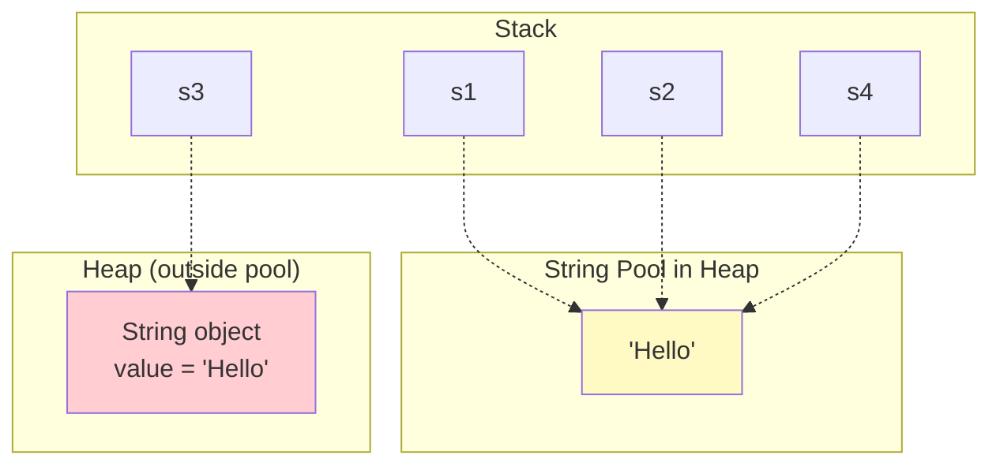
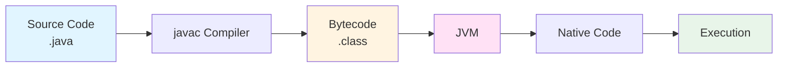
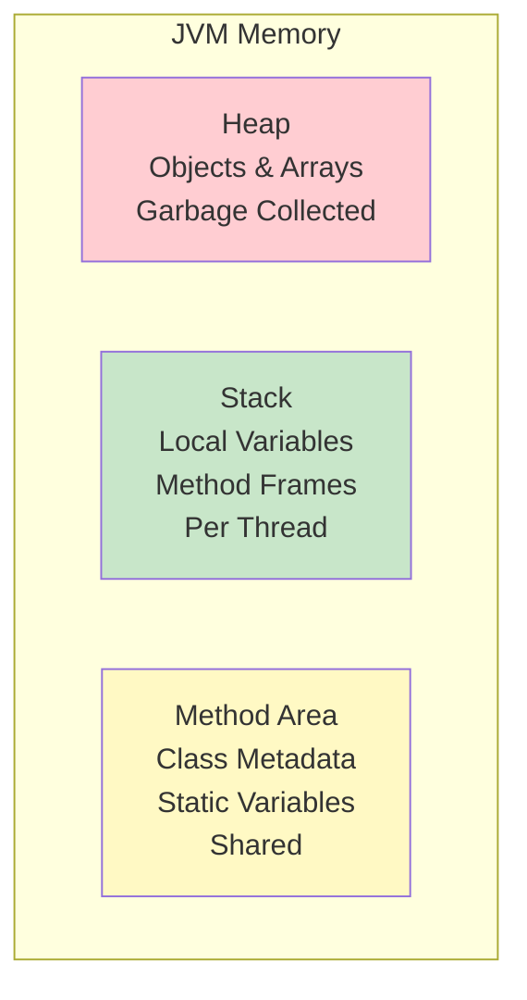
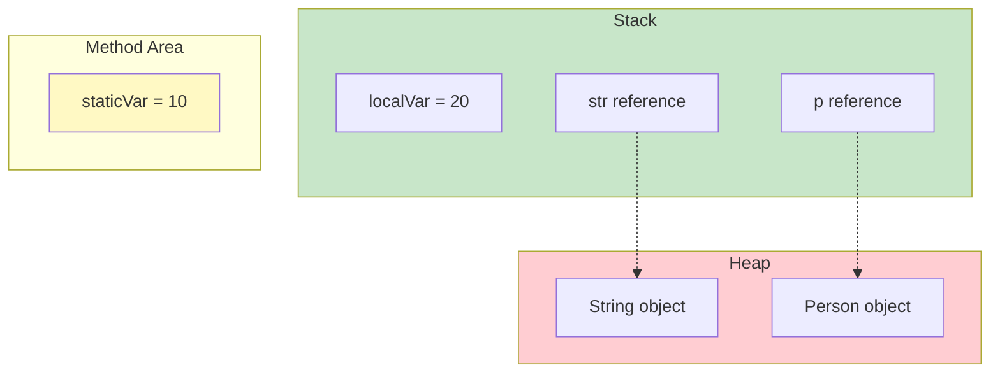
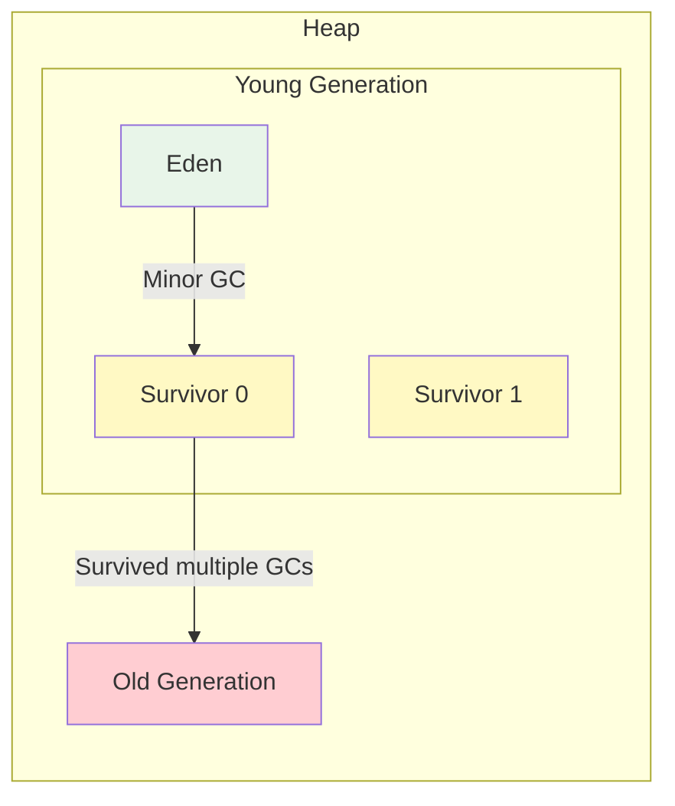

# Java Essentials - Language Mechanics & Key Differences

## Phase 1: Concept Foundation

### 1.1 What is Java?

**Java** is a high-level, class-based, object-oriented programming language designed for **platform independence** through the JVM (Java Virtual Machine).

**Key Problems it Solves:**
- Cross-platform compatibility (WORA - Write Once, Run Anywhere)
- Automatic memory management (Garbage Collection)
- Eliminates pointer-related errors
- Type safety at compile time

### 1.2 Core Java Principles

1. **Platform Independence** - Bytecode runs on any JVM
2. **Automatic Memory Management** - Garbage collector handles deallocation
3. **No Explicit Pointers** - References only, safer than C++
4. **Strongly Typed** - All type checking at compile time
5. **Everything is an Object** (except 8 primitives)

---

## Phase 2: Language Implementation

### 2.1 Java Program Structure

```java
package com.example;           // Package declaration (optional, must be first)

import java.util.*;            // Import statements

public class HelloWorld {      // Public class must match filename
    
    static int classVar = 10;  // Class variable (static)
    int instanceVar;            // Instance variable
    
    // Constructor
    public HelloWorld() {
        instanceVar = 20;
    }
    
    // main - entry point (signature must be exact)
    public static void main(String[] args) {
        System.out.println("Hello, World!");
    }
}
```

**Critical Rules:**
- File name must match public class name
- Only one public class per file
- `main()` signature must be: `public static void main(String[] args)`

---

### 2.2 Data Types - Key Differences from C++

#### Primitives vs Reference Types

| Java Concept | C++ Equivalent | Key Difference |
|--------------|----------------|----------------|
| Primitives (8 types) | Built-in types | Similar, but `boolean` not `bool` |
| Reference types | Pointers/References | No explicit pointer syntax (`*`, `->`) |
| `char` | `char` | 2 bytes (Unicode) vs 1 byte (ASCII) |
| Arrays | Arrays | Always objects, bounds-checked |

```java
// Primitives (8 types only)
int age = 25;              // 4 bytes
long big = 100L;           // 8 bytes, L suffix required
float pi = 3.14f;          // 4 bytes, f suffix required
double e = 2.718;          // 8 bytes, default for decimals
char letter = 'A';         // 2 bytes (Unicode)
boolean flag = true;       // true/false (not 0/1)

// Reference types - always use 'new' or literals
String name = "Java";      // String literal
int[] arr = {1, 2, 3};     // Array
Object obj = new Object(); // Object instantiation
```

---

### 2.3 Arrays - Java Specifics

```java
// Declaration and initialization
int[] numbers = new int[5];        // Default values (0)
int[] nums = {1, 2, 3, 4, 5};     // Array initializer

// Length is a property (not method)
int len = numbers.length;          // NOT length()

// Multi-dimensional arrays
int[][] matrix = new int[3][4];
int[][] grid = {{1, 2}, {3, 4}};

// Jagged arrays (different row lengths)
int[][] jagged = new int[3][];
jagged[0] = new int[2];
jagged[1] = new int[4];
```

**Java vs C++ Arrays:**

| Feature | Java | C++ |
|---------|------|-----|
| Bounds checking | ✓ Always | ✗ Manual |
| Length tracking | `.length` property | Must track manually |
| Memory | Heap only | Stack or Heap |
| Exception | `ArrayIndexOutOfBoundsException` | Undefined behavior |

---

### 2.4 Strings - Major Differences

#### String Immutability

```java
// Strings are IMMUTABLE
String str = "Hello";
str.concat(" World");          // Returns new String
System.out.println(str);       // Still "Hello"

String modified = str.concat(" World");
System.out.println(modified);  // "Hello World"
```

#### String Pool

```java
// String Pool - unique to Java
String s1 = "Hello";           // Created in String Pool
String s2 = "Hello";           // Reuses s1 from pool
String s3 = new String("Hello"); // New object in Heap

System.out.println(s1 == s2);    // true (same reference)
System.out.println(s1 == s3);    // false (different objects)
System.out.println(s1.equals(s3)); // true (same content)

// intern() - move to pool
String s4 = s3.intern();
System.out.println(s1 == s4);    // true
```



#### StringBuilder vs StringBuffer

```java
// For string manipulation (mutable)
StringBuilder sb = new StringBuilder();
sb.append("Hello");
sb.append(" World");
String result = sb.toString();

// StringBuffer - thread-safe version (slower)
StringBuffer sbf = new StringBuffer();
sbf.append("Thread-safe");
```

**When to use:**
- **String**: Immutable, unchanging text
- **StringBuilder**: Mutable, single-threaded (fast)
- **StringBuffer**: Mutable, multi-threaded (thread-safe)

---

### 2.5 Wrapper Classes & Autoboxing

```java
// Wrapper classes for primitives
Integer obj = 10;              // Autoboxing (automatic)
int val = obj;                 // Unboxing (automatic)

// Actually compiled as:
Integer obj = Integer.valueOf(10);
int val = obj.intValue();

// All wrapper classes
Byte, Short, Integer, Long, Float, Double, Character, Boolean
```

#### Integer Caching Trap

```java
// Java caches Integer objects from -128 to 127
Integer a = 127;
Integer b = 127;
System.out.println(a == b);    // true (same cached object)

Integer c = 128;
Integer d = 128;
System.out.println(c == d);    // false (different objects)

// ALWAYS use equals() for wrapper comparison
System.out.println(c.equals(d)); // true
```

**Java vs C++:**

| Feature | Java | C++ |
|---------|------|-----|
| Boxing/Unboxing | Automatic | Manual (cast) |
| Wrapper classes | Built-in (Integer, etc.) | No equivalent |
| Null primitives | No (use wrappers) | No |

---

### 2.6 Pass by Value (Critical Concept)

```java
// Java is ALWAYS pass-by-value (even for objects)

// Primitives - copy of value
void changePrimitive(int x) {
    x = 100;  // Changes local copy only
}

int num = 10;
changePrimitive(num);
System.out.println(num);       // Still 10

// Objects - copy of reference
void changeReference(int[] arr) {
    arr[0] = 100;  // Modifies original array
}

int[] array = {1, 2, 3};
changeReference(array);
System.out.println(array[0]);  // 100

// Reassigning reference doesn't affect original
void reassign(int[] arr) {
    arr = new int[]{10, 20, 30};  // Only local reference changes
}

int[] original = {1, 2, 3};
reassign(original);
System.out.println(original[0]); // Still 1
```

**Java vs C++:**

| Feature | Java | C++ |
|---------|------|-----|
| Pass by reference | ✗ Not available | ✓ Available (`int&`) |
| Pass mechanism | Always by value | By value or reference |
| Pointer passing | References (automatic) | Pointers (explicit `*`) |

---

### 2.7 Access Modifiers

| Modifier | Same Class | Same Package | Subclass | Different Package |
|----------|-----------|--------------|----------|-------------------|
| `private` | ✓ | ✗ | ✗ | ✗ |
| default (package-private) | ✓ | ✓ | ✗ | ✗ |
| `protected` | ✓ | ✓ | ✓ | ✗ |
| `public` | ✓ | ✓ | ✓ | ✓ |

```java
public class AccessDemo {
    private int privateVar = 10;      // Only within class
    int defaultVar = 20;              // Within package
    protected int protectedVar = 30;  // Within package + subclasses
    public int publicVar = 40;        // Everywhere
}
```

**Key Difference from C++:**
- **Java default**: Package-private (accessible in same package)
- **C++ default**: Private (not accessible outside class)

---

### 2.8 Keywords: final, static, this

#### final

```java
// final variable - constant
final int MAX_SIZE = 100;
// MAX_SIZE = 200; // Compile error

// final method - cannot be overridden
class Parent {
    public final void display() { }
}

// final class - cannot be extended
final class FinalClass { }

// final with objects - reference is constant
final int[] arr = {1, 2, 3};
arr[0] = 10;           // OK - modifying content
// arr = new int[5];   // Error - cannot reassign reference
```

#### static

```java
public class StaticDemo {
    
    static int count = 0;      // Shared by all instances
    int id;                     // Each instance has own copy
    
    public StaticDemo() {
        count++;
        id = count;
    }
    
    // static method - called on class
    public static void display() {
        System.out.println(count);
        // Cannot access instance variables
    }
    
    // static block - runs once when class loads
    static {
        System.out.println("Class loaded");
        count = 10;
    }
}

// Usage
StaticDemo.display();          // Called on class name
StaticDemo obj = new StaticDemo();
```

#### this

```java
public class ThisDemo {
    private int x;
    
    // Differentiate parameter from instance variable
    public ThisDemo(int x) {
        this.x = x;
    }
    
    // Call another constructor
    public ThisDemo() {
        this(0);
    }
    
    // Method chaining
    public ThisDemo setX(int x) {
        this.x = x;
        return this;
    }
}
```

---

## Phase 3: Internal Mechanics

### 3.1 Compilation & Execution Flow

**Compile Time:**
1. `.java` source file → Java Compiler (`javac`)
2. Syntax checking, type checking
3. Generates `.class` bytecode (platform-independent)

**Runtime:**
1. Class Loader loads `.class` files
2. Bytecode Verifier ensures code safety
3. JIT Compiler converts bytecode to native machine code
4. Execution Engine runs the code
5. Garbage Collector manages memory



**Key Terms:**
- **JVM**: Java Virtual Machine (platform-specific runtime)
- **JRE**: JVM + standard libraries (to run Java programs)
- **JDK**: JRE + development tools (to develop Java programs)

**Relationship:** JDK ⊃ JRE ⊃ JVM

---

### 3.2 Memory Model



**Heap:**
- All objects and arrays
- Shared among threads
- Garbage collected
- Divided into Young and Old generations

**Stack:**
- Local variables and method call frames
- Each thread has its own stack
- Automatically managed (no GC)
- LIFO structure

**Method Area:**
- Class metadata, static variables, constant pool
- Shared among threads

**Example:**

```java
public class MemoryDemo {
    static int staticVar = 10;    // Method Area
    
    public void method() {
        int localVar = 20;        // Stack
        String str = new String("Hello"); 
        // "str" reference on Stack
        // String object on Heap
        
        Person p = new Person();  
        // "p" reference on Stack
        // Person object on Heap
    }
}
```



**Java vs C++:**

| Feature | Java | C++ |
|---------|------|-----|
| Object location | Always Heap | Stack or Heap |
| Memory management | Automatic (GC) | Manual (new/delete) |
| Stack overflow | Rare | More common |
| Heap fragmentation | GC handles | Manual management |

---

### 3.3 Garbage Collection

**What is GC?**
Automatic memory reclamation of objects no longer in use.

**How it works:**
1. **Mark**: Identifies reachable objects from GC roots
2. **Sweep**: Removes unreachable objects
3. **Compact**: Defragments memory (optional)

**GC Roots:**
- Local variables in active methods
- Static variables
- Active threads



**Making Objects Eligible for GC:**

```java
// 1. Nullifying reference
Object obj = new Object();
obj = null; // Now eligible

// 2. Reassigning reference
Object obj1 = new Object();
obj1 = new Object(); // First object eligible

// 3. Local variable goes out of scope
public void method() {
    Object obj = new Object();
} // obj eligible after method returns

// 4. Island of isolation (circular references OK)
Node n1 = new Node();
Node n2 = new Node();
n1.next = n2;
n2.next = n1;

n1 = null;
n2 = null; // Both eligible (GC handles cycles)
```

**Request GC (not guaranteed):**
```java
System.gc();
Runtime.getRuntime().gc();
```

**Java vs C++:**

| Feature | Java | C++ |
|---------|------|-----|
| Memory deallocation | Automatic | Manual (`delete`) |
| Memory leaks | Rare (GC handles) | Common if forgot `delete` |
| Destructor | No (finalize deprecated) | Yes (`~ClassName()`) |
| Circular references | GC handles | Memory leak |

---

### 3.4 String Immutability Deep Dive

**Why Strings are Immutable:**

1. **String Pool Optimization**: Multiple references share same object
2. **Security**: Sensitive data (passwords, URLs) can't be changed
3. **Thread Safety**: Can be shared without synchronization
4. **Hashcode Caching**: Hash computed once, used in HashMap/HashSet

```java
String s1 = "Hello";
String s2 = "Hello";
String s3 = s1.concat(" World");

// s1 and s2 point to same object in pool
// concat() creates NEW object, s1 unchanged
System.out.println(s1);  // "Hello"
System.out.println(s3);  // "Hello World"
```

**Performance Implication:**

```java
// BAD - Creates many String objects
String result = "";
for (int i = 0; i < 1000; i++) {
    result += i; // New String object each iteration
}

// GOOD - Mutable, single object modified
StringBuilder sb = new StringBuilder();
for (int i = 0; i < 1000; i++) {
    sb.append(i);
}
String result = sb.toString();
```

---

## Phase 4: Critical Differences Summary

### Java vs C++ Key Comparisons

| Feature | Java | C++ |
|---------|------|-----|
| **Pointers** | No explicit pointers | Full pointer support (`*`, `->`) |
| **Memory Management** | Automatic GC | Manual (new/delete) |
| **Multiple Inheritance** | No (interfaces only) | Yes |
| **Operator Overloading** | No | Yes |
| **Platform** | WORA (bytecode + JVM) | Platform-specific binaries |
| **Default Access** | Package-private | Private |
| **goto** | Reserved, not used | Available |
| **Destructors** | No (finalize deprecated) | Yes (`~ClassName()`) |
| **Pass by Reference** | No (always by value) | Yes (`int&`) |
| **Preprocessor** | No | Yes (`#include`, `#define`) |
| **Templates/Generics** | Type erasure | Template instantiation |
| **Array Bounds** | Checked (exception) | Unchecked (UB) |
| **char size** | 2 bytes (Unicode) | 1 byte (ASCII) |
| **Header files** | No | Yes (`.h`) |

---

## Phase 5: Common Mistakes & Pitfalls

### 1. == vs equals() Confusion

```java
// ❌ Wrong
String s1 = new String("Hello");
String s2 = new String("Hello");
if (s1 == s2) { } // false - compares references

// ✅ Correct
if (s1.equals(s2)) { } // true - compares content
```

### 2. Integer Caching Trap

```java
Integer a = 127;
Integer b = 127;
System.out.println(a == b);    // true (cached)

Integer c = 128;
Integer d = 128;
System.out.println(c == d);    // false (not cached)
System.out.println(c.equals(d)); // ✅ Always use equals()
```

### 3. NullPointerException

```java
// ❌ Common mistake
String str = null;
if (str.equals("Hello")) { } // NPE!

// ✅ Safe approaches
if ("Hello".equals(str)) { } // No NPE
if (str != null && str.equals("Hello")) { } // Explicit check
```

### 4. Array Index Bounds

```java
int[] arr = new int[5];

// ❌ Wrong
for (int i = 0; i <= arr.length; i++) { // <= causes exception
    System.out.println(arr[i]);
}

// ✅ Correct
for (int i = 0; i < arr.length; i++) {
    System.out.println(arr[i]);
}
```

### 5. String Concatenation in Loops

```java
// ❌ Inefficient
String result = "";
for (int i = 0; i < 1000; i++) {
    result += i; // New String each time
}

// ✅ Efficient
StringBuilder sb = new StringBuilder();
for (int i = 0; i < 1000; i++) {
    sb.append(i);
}
```

### 6. Pass by Value Misunderstanding

```java
// ❌ Doesn't work - Java is pass by value
public void swap(int a, int b) {
    int temp = a;
    a = b;
    b = temp; // Only local copies changed
}

// ✅ Workaround - use array/object
public void swap(int[] arr) {
    int temp = arr[0];
    arr[0] = arr[1];
    arr[1] = temp;
}
```

---

## Phase 6: Interview Quick Reference

### Conceptual Questions

**Q: Why is Java platform-independent?**
**A:** Java compiles to bytecode (`.class`), not machine code. Bytecode runs on any JVM. JVM is platform-specific and translates bytecode to native code.

---

**Q: Difference between JDK, JRE, and JVM?**
**A:** 
- **JVM**: Runtime that executes bytecode
- **JRE**: JVM + libraries (to run programs)
- **JDK**: JRE + tools (to develop programs)
- Relationship: JDK ⊃ JRE ⊃ JVM

---

**Q: Why is String immutable?**
**A:** Security, thread safety, hash code caching, String pool optimization.

---

**Q: == vs equals()?**
**A:** `==` compares references (memory address), `equals()` compares content.

---

**Q: Explain pass-by-value in Java.**
**A:** Java always passes by value. For primitives, value is copied. For objects, reference value is copied (not the object). You can modify object state, but cannot reassign the original reference.

---

**Q: What is autoboxing?**
**A:** Automatic conversion between primitive and wrapper. `Integer obj = 10;` (autoboxing), `int val = obj;` (unboxing).

---

**Q: How does garbage collection work?**
**A:** Automatic memory reclamation. Mark reachable objects from GC roots, sweep unreachable objects, optionally compact. Uses generational approach (Young and Old generations).

---

### Code-Based Questions

**Q: What is the output?**

```java
Integer a = 127;
Integer b = 127;
Integer c = 128;
Integer d = 128;

System.out.println(a == b);
System.out.println(c == d);
```

**A:** 
```
true
false
```
**Reason:** Integer caching for -128 to 127.

---

**Q: What is the output?**

```java
String s1 = "Hello";
String s2 = "Hello";
String s3 = new String("Hello");
String s4 = s3.intern();

System.out.println(s1 == s2);
System.out.println(s1 == s3);
System.out.println(s1 == s4);
```

**A:**
```
true
false
true
```
**Reason:** s1 and s2 from pool, s3 is heap object, s4.intern() returns pool reference.

---

### Quick Revision Checklist

✓ **Java = platform-independent** (bytecode + JVM)
✓ **No pointers** (references only, safer)
✓ **Automatic GC** (no manual delete)
✓ **8 primitives** (int, long, float, double, char, boolean, byte, short)
✓ **Wrapper classes** with autoboxing/unboxing
✓ **String immutable** (use StringBuilder for modification)
✓ **String pool** for memory optimization
✓ **Always pass-by-value** (even objects pass reference value)
✓ **Use equals() not ==** for object comparison
✓ **Integer caching** -128 to 127
✓ **Arrays always on heap**, bounds-checked
✓ **GC handles memory** (mark, sweep, compact)
✓ **Default access = package-private** (not private like C++)

---

*End of Java Essentials Documentation*