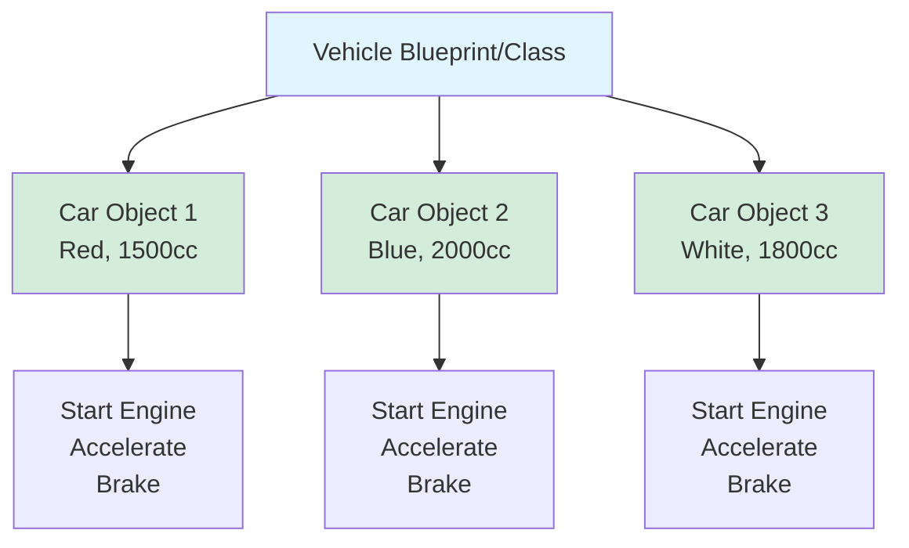
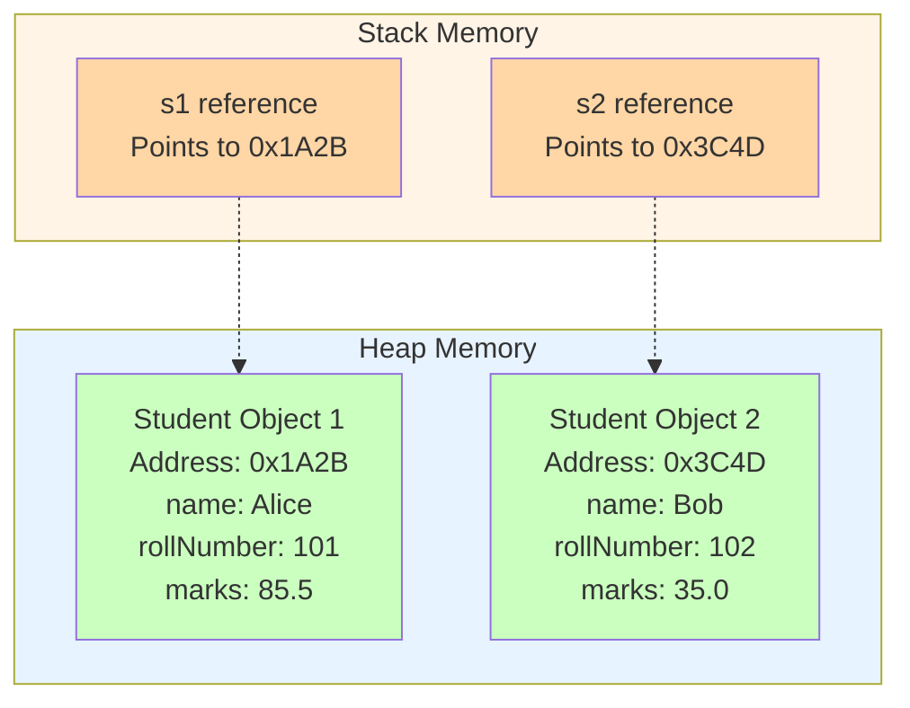
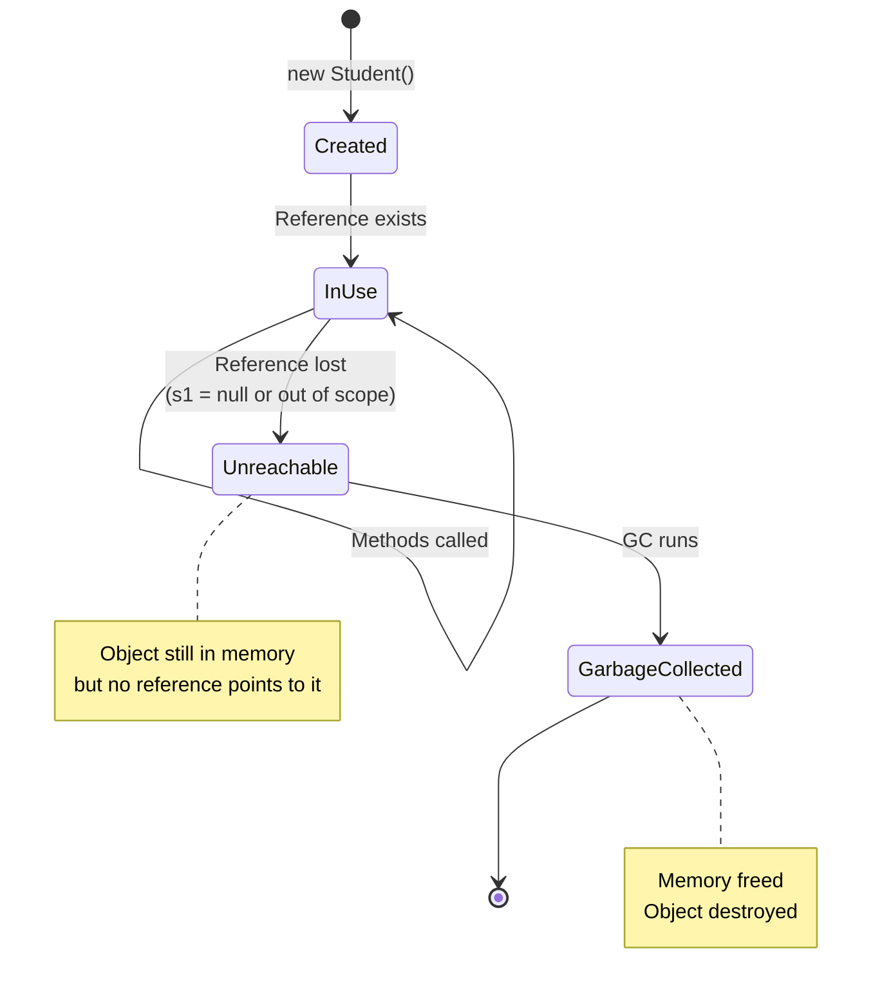
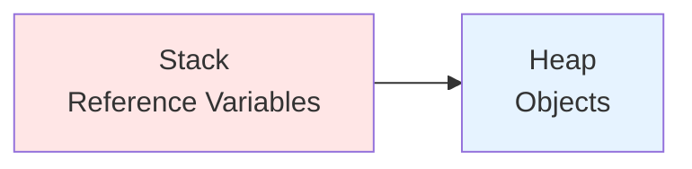
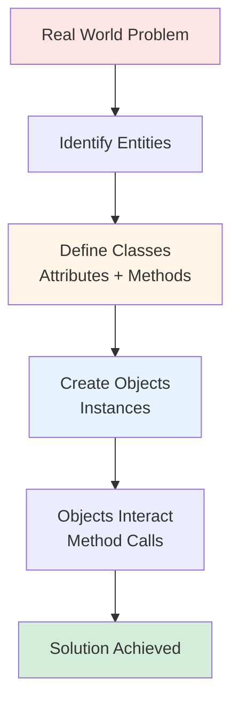

# Object-Oriented Programming (OOP) - Complete Guide

---

## Phase 1: Concept Foundation

### 1. What is Object-Oriented Programming (OOP)?

**Object-Oriented Programming (OOP)** is a programming paradigm that organizes software design around **objects** rather than functions and logic. An object is a self-contained entity that contains both **data** (attributes) and **behavior** (methods).

**Core Idea:** Model real-world entities as objects that interact with each other.

#### Key Components:
- **Objects**: Instances of classes representing real-world entities
- **Classes**: Blueprints/templates for creating objects
- **Attributes**: Data/properties that define the state of an object
- **Methods**: Functions that define the behavior of an object

---

### 2. Difference Between Procedural and OOP

| Aspect | Procedural Programming | Object-Oriented Programming |
|--------|------------------------|----------------------------|
| **Focus** | Functions/Procedures | Objects (data + methods) |
| **Approach** | Top-down | Bottom-up |
| **Data Access** | Global data accessible by all functions | Data encapsulated within objects |
| **Code Organization** | Function-based | Class-based |
| **Reusability** | Through functions | Through inheritance, polymorphism |
| **Security** | Less secure (data exposed) | More secure (data hiding/encapsulation) |
| **Maintainability** | Harder for large projects | Easier through modularity |
| **Real-World Modeling** | Difficult | Natural and intuitive |
| **Example Languages** | C, Pascal, FORTRAN, BASIC | Java, C++, Python, C#, Ruby |

#### Procedural Example (C):
```c
// Global data
int balance = 1000;

// Functions operating on global data
void deposit(int amount) {
    balance += amount;
}

void withdraw(int amount) {
    if (amount <= balance) {
        balance -= amount;
    }
}

int getBalance() {
    return balance;
}
```

#### OOP Example (Java):
```java
class BankAccount {
    private int balance = 1000;  // Encapsulated data
    
    public void deposit(int amount) {
        balance += amount;
    }
    
    public void withdraw(int amount) {
        if (amount <= balance) {
            balance -= amount;
        }
    }
    
    public int getBalance() {
        return balance;
    }
}
```

---

### 3. Why Use OOP? (Key Advantages)

#### **1. Modularity**
- Code is divided into independent, self-contained modules (classes)
- Each class represents a single entity with specific responsibilities
- Changes in one module don't affect others
- **Example:** `BankAccount`, `Customer`, `Transaction` classes work independently

#### **2. Reusability**
- Code can be reused through **inheritance** and **composition**
- Once written, classes can be used across multiple projects
- Libraries and frameworks leverage reusability
- **Example:** Create a `Vehicle` class, reuse it for `Car`, `Bike`, `Truck`

#### **3. Scalability**
- Easy to add new features without breaking existing code
- New classes can be added without modifying old ones
- System grows organically
- **Example:** Add `SavingsAccount` by extending `BankAccount`

#### **4. Security (Data Hiding/Encapsulation)**
- Data is hidden from unauthorized access using access modifiers
- Only exposed through controlled interfaces (methods)
- Prevents accidental data corruption
- **Example:** `private` balance can only be modified through `deposit()` and `withdraw()`

#### **5. Maintainability**
- Code is organized logically, making it easier to understand
- Bugs can be isolated to specific classes
- Testing is easier with modular code
- **Example:** Fix account logic only in `BankAccount` class

#### **6. Flexibility & Extensibility**
- Polymorphism allows flexible code execution
- Easy to extend functionality through inheritance
- **Example:** Add new account types without changing core banking logic

#### **7. Code Organization & Readability**
- Maps naturally to real-world entities
- Intuitive structure improves team collaboration
- Self-documenting code
- **Example:** `Customer.makePayment()` is self-explanatory

#### **8. Abstraction**
- Hide complex implementation details
- Show only essential features
- Reduces complexity for users
- **Example:** Use `car.start()` without knowing engine internals

---

### 4. Real-World Analogy of OOP

#### **The Car Manufacturing Analogy**

Think of OOP like an automobile manufacturing system:

**1. Blueprint (Class):**
- A car **design document** is like a **class**
- It defines what features a car should have (engine, wheels, color)
- The blueprint itself is not a car—it's just a template
- Multiple cars can be built from the same blueprint

**2. Actual Car (Object):**
- Each **manufactured car** is an **object** (instance of the class)
- Every car has its own specific values (red color, 2000cc engine)
- Each car exists independently in memory

**3. Properties (Attributes):**
- Color, model, engine capacity, fuel level
- Each car has its own values for these properties

**4. Actions (Methods):**
- Start engine, accelerate, brake, turn
- All cars can perform these actions, but independently

**5. Encapsulation:**
- The engine is **hidden** inside the car body
- You interact through **interfaces** (steering wheel, pedals)
- You don't need to know how the engine works internally

**6. Inheritance:**
- **Base blueprint:** Generic Vehicle
- **Specialized blueprints:** Car, Truck, Motorcycle
- All inherit common features (wheels, engine) but add specific ones

**7. Polymorphism:**
- All vehicles can `start()`, but a car starts differently than a motorcycle
- Same action, different implementation



#### **Another Analogy: Restaurant System**

| Real World | OOP Concept |
|------------|-------------|
| Restaurant (concept) | Class |
| Specific restaurant location | Object |
| Menu items, capacity, location | Attributes |
| takeOrder(), servFood(), billing() | Methods |
| Kitchen operations hidden from customers | Encapsulation |
| FastFoodRestaurant extends Restaurant | Inheritance |
| Different restaurants process orders differently | Polymorphism |

---

### 5. Why is OOP Better for Large-Scale Applications?

#### **Problem with Procedural Approach in Large Systems:**

```c
// Procedural nightmare for large systems
int user1_balance = 1000;
int user2_balance = 2000;
int user3_balance = 1500;
// ... hundreds of global variables

void transfer_money_user1_to_user2(int amount) {
    if (user1_balance >= amount) {
        user1_balance -= amount;
        user2_balance += amount;
    }
}

void transfer_money_user2_to_user3(int amount) {
    // More duplicate code
}

// Imagine managing 10,000 users!
```

**Problems:**
- Data scattered everywhere
- Duplicate code for similar operations
- No clear ownership of data
- Hard to debug and maintain
- Security risks (any function can modify any data)

---

#### **OOP Solution for Large Systems:**

```java
class BankAccount {
    private String accountNumber;
    private double balance;
    private String ownerName;
    
    public void transfer(BankAccount recipient, double amount) {
        if (this.balance >= amount) {
            this.balance -= amount;
            recipient.deposit(amount);
        }
    }
    
    private void deposit(double amount) {
        this.balance += amount;
    }
}

// Managing 10,000 users is now simple
List<BankAccount> accounts = new ArrayList<>();
// Each account manages its own data and behavior
```

---

#### **Key Reasons OOP Scales Better:**

**1. Encapsulation Manages Complexity**
- Each class is a **black box** with well-defined interfaces
- Internal changes don't break external code
- Example: Change how balance is calculated internally without affecting code that uses the class

**2. Modularity Enables Team Collaboration**
- Different teams can work on different classes simultaneously
- Example: 
  - Team A: `Customer` and `Account` classes
  - Team B: `Transaction` and `Payment` classes
  - Team C: `Report` and `Analytics` classes

**3. Inheritance Reduces Code Duplication**
```java
// Base class with common functionality
class Account {
    protected double balance;
    public void deposit(double amount) { }
}

// Specialized accounts reuse base logic
class SavingsAccount extends Account {
    private double interestRate;
}

class CurrentAccount extends Account {
    private double overdraftLimit;
}
```

**4. Polymorphism Enables Flexible Design**
```java
// Process any account type uniformly
void processMonthlyInterest(Account account) {
    account.calculateInterest();  // Different logic for each type
}
```

**5. Abstraction Hides Complexity**
- Users interact with simple interfaces
- Complex implementation hidden
- Example: `paymentGateway.processPayment()` hides encryption, API calls, validation

**6. Maintainability Through Clear Structure**
- Bug in savings account logic? Fix only `SavingsAccount` class
- Need new feature? Add new class without touching existing code
- Logical organization mirrors business domain

**7. Testability**
- Each class can be tested independently (unit testing)
- Mock objects can simulate dependencies
- Easier to write automated tests

**8. Design Patterns**
- OOP enables proven architectural patterns
- Singleton, Factory, Observer, Strategy patterns
- Industry-standard solutions for common problems

---

#### **Comparison: Small vs Large Scale**

| Factor | Small Application | Large Application |
|--------|------------------|-------------------|
| **Codebase Size** | Few hundred lines | Millions of lines |
| **Team Size** | 1-3 developers | 50-500+ developers |
| **Procedural Impact** | Manageable | Unmanageable chaos |
| **OOP Impact** | May seem over-engineered | Essential for survival |
| **Change Frequency** | Occasional | Continuous |
| **Bug Isolation** | Easy in both | Impossible in procedural, easy in OOP |

---

#### **Real-World Large Scale Example:**

**E-commerce System (e.g., Amazon)**

```java
// Clean OOP structure
class User { }
class Product { }
class ShoppingCart { }
class Order { }
class Payment { }
class Shipping { }
class Review { }
class Recommendation { }
class Inventory { }
class Seller { }

// Each class manages its own responsibility
// Changes in Payment don't affect Shipping
// New feature (Wishlist) is just a new class
```

**Without OOP:**
- Thousands of global functions
- Massive global data structures
- Impossible to maintain
- Any change could break everything

---

## Phase 2: Language Implementation

### 1. Basic OOP in Java

#### **Defining a Class:**
```java
class Student {
    // Attributes (data)
    private String name;
    private int rollNumber;
    private double marks;
    
    // Constructor
    public Student(String name, int rollNumber, double marks) {
        this.name = name;
        this.rollNumber = rollNumber;
        this.marks = marks;
    }
    
    // Methods (behavior)
    public void displayInfo() {
        System.out.println("Name: " + name);
        System.out.println("Roll: " + rollNumber);
        System.out.println("Marks: " + marks);
    }
    
    public boolean hasPassed() {
        return marks >= 40.0;
    }
}
```

#### **Creating Objects:**
```java
public class Main {
    public static void main(String[] args) {
        // Creating objects
        Student s1 = new Student("Alice", 101, 85.5);
        Student s2 = new Student("Bob", 102, 35.0);
        
        // Using objects
        s1.displayInfo();
        System.out.println("Passed: " + s1.hasPassed());
        
        s2.displayInfo();
        System.out.println("Passed: " + s2.hasPassed());
    }
}
```

---

### 2. C++ Comparison

| Feature | Java | C++ |
|---------|------|-----|
| **Class Definition** | `class Student { }` | `class Student { };` (semicolon required) |
| **Object Creation** | `Student s = new Student();` | `Student s;` or `Student* s = new Student();` |
| **Access Modifiers** | `private`, `protected`, `public` | Same + `private` is default for class |
| **Memory Management** | Automatic (Garbage Collection) | Manual (delete keyword) |
| **Inheritance** | `extends` keyword | `: public BaseClass` |
| **Multiple Inheritance** | Not supported (use interfaces) | Supported |
| **Constructors** | Same name as class | Same name as class |
| **Destructors** | Finalize method (rarely used) | `~ClassName()` (important) |
| **Method Overriding** | `@Override` annotation | `virtual` keyword |
| **Default Access** | Package-private | Private for class members |

#### **C++ Example:**
```cpp
#include <iostream>
using namespace std;

class Student {
private:
    string name;
    int rollNumber;
    double marks;
    
public:
    // Constructor
    Student(string n, int r, double m) : name(n), rollNumber(r), marks(m) {}
    
    // Destructor (important in C++)
    ~Student() {
        cout << "Student object destroyed" << endl;
    }
    
    void displayInfo() {
        cout << "Name: " << name << endl;
        cout << "Roll: " << rollNumber << endl;
        cout << "Marks: " << marks << endl;
    }
    
    bool hasPassed() {
        return marks >= 40.0;
    }
};

int main() {
    // Stack allocation (automatic cleanup)
    Student s1("Alice", 101, 85.5);
    s1.displayInfo();
    
    // Heap allocation (manual cleanup required)
    Student* s2 = new Student("Bob", 102, 35.0);
    s2->displayInfo();
    delete s2;  // Must manually delete!
    
    return 0;
}
```

**Key C++ Differences:**
1. **Memory Management:** C++ requires explicit `delete`, Java has garbage collection
2. **Pointers:** C++ uses pointers (`->`), Java uses references (`.`)
3. **Destructors:** C++ destructors are crucial for cleanup, Java rarely uses finalizers
4. **Multiple Inheritance:** C++ allows it, Java doesn't

---

## Phase 3: Internal Mechanics

### 1. Under-the-Hood: What Happens During Object Creation

#### **Java Object Creation Process:**

```java
Student s1 = new Student("Alice", 101, 85.5);
```

**Step-by-Step Execution:**

**1. Compile Time:**
- Compiler checks if `Student` class exists
- Verifies constructor signature matches
- Verifies types of arguments
- Generates bytecode

**2. Runtime - Memory Allocation:**
- JVM allocates memory in **Heap** for the object
- Memory size = sum of all instance variable sizes
- All instance variables initialized to default values (0, null, false)

**3. Constructor Execution:**
- Constructor code runs
- Instance variables set to provided values
- Object is now fully initialized

**4. Reference Assignment:**
- Reference variable `s1` created in **Stack**
- `s1` stores memory address of object in Heap
- `s1` now "points to" the object

---

### 2. Memory Layout



---

### 3. Object Lifecycle



---

### 4. Stack vs Heap Detailed

| Aspect | Stack Memory | Heap Memory |
|--------|--------------|-------------|
| **Stores** | Local variables, method calls, references | Objects, instance variables |
| **Size** | Smaller (few MB) | Larger (can be GB) |
| **Speed** | Very fast | Slower |
| **Lifetime** | Method scope | Until garbage collected |
| **Management** | Automatic (LIFO) | Garbage Collector |
| **Thread Safety** | Each thread has own stack | Shared across threads |

```java
void createStudent() {
    // 's1' reference created in Stack
    // Student object created in Heap
    Student s1 = new Student("Alice", 101, 85.5);
    
    // When method ends:
    // - Stack cleared (s1 reference removed)
    // - Heap object becomes unreachable
    // - Eventually garbage collected
}
```

---

### 5. What Happens at Compile Time vs Runtime

| Phase | Java | C++ |
|-------|------|-----|
| **Compile Time** | ✓ Syntax check<br/>✓ Type checking<br/>✓ Method signature verification<br/>✓ Generates bytecode (.class) | ✓ Same checks<br/>✓ Template instantiation<br/>✓ Generates machine code |
| **Runtime** | ✓ Class loading<br/>✓ Memory allocation<br/>✓ Object creation<br/>✓ Method invocation<br/>✓ Garbage collection | ✓ Direct execution<br/>✓ Manual memory management<br/>✓ No class loading overhead |

---

## Phase 4: Practical Design Perspective

### 1. Design Implications

#### **When to Use OOP:**
✓ Building systems with multiple interacting entities  
✓ Need for code reusability across projects  
✓ Large team collaboration  
✓ Long-term maintainable codebase  
✓ Real-world domain modeling  
✓ GUI applications  
✓ Enterprise applications  

#### **When NOT to Use OOP:**
✗ Simple scripts and automation  
✗ Performance-critical systems (game engines, embedded systems)  
✗ Mathematical computations (functional programming better)  
✗ Small utilities with no state  

---

### 2. Common Mistakes & Pitfalls

#### **1. God Object Anti-Pattern**
```java
// BAD: One class doing everything
class Application {
    void handleUser() { }
    void processPayment() { }
    void sendEmail() { }
    void generateReport() { }
    void manageInventory() { }
    // 50 more methods...
}

// GOOD: Separate responsibilities
class UserManager { }
class PaymentProcessor { }
class EmailService { }
class ReportGenerator { }
class InventoryManager { }
```

#### **2. Forgetting Encapsulation**
```java
// BAD: Public data members
class BankAccount {
    public double balance;  // Anyone can modify!
}

// GOOD: Private data with controlled access
class BankAccount {
    private double balance;
    
    public void deposit(double amount) {
        if (amount > 0) {
            balance += amount;
        }
    }
}
```

#### **3. Overusing Inheritance**
```java
// BAD: Deep inheritance hierarchies
class Animal { }
class Mammal extends Animal { }
class Carnivore extends Mammal { }
class Dog extends Carnivore { }
class GermanShepherd extends Dog { }

// GOOD: Prefer composition
class GermanShepherd {
    private Diet diet = new CarnivoreDiet();
    private Species species = new Canine();
}
```

#### **4. Not Understanding Object References**
```java
Student s1 = new Student("Alice", 101, 85.5);
Student s2 = s1;  // Both reference same object!
s2.setMarks(90.0);
// s1.getMarks() is also 90.0 now!
```

---

## Phase 5: Interview Mastery

### 1. Frequently Asked Interview Questions

#### **Conceptual Questions:**

**Q1: What is OOP and why is it used?**
- Programming paradigm based on objects containing data and methods
- Benefits: modularity, reusability, maintainability, security
- Models real-world entities naturally

**Q2: What are the main principles of OOP?**
- Encapsulation (data hiding)
- Inheritance (code reuse)
- Polymorphism (many forms)
- Abstraction (hiding complexity)

**Q3: Difference between procedural and OOP?**
- Procedural: function-based, global data
- OOP: object-based, encapsulated data
- OOP better for large, complex systems

**Q4: Why is OOP better for large applications?**
- Modularity enables team collaboration
- Encapsulation isolates changes
- Inheritance reduces duplication
- Easier testing and maintenance

**Q5: Explain class vs object with real-world example.**
- Class = blueprint (car design)
- Object = instance (actual manufactured car)
- Multiple objects from one class

---

#### **Code-Based Questions:**

**Q6: What's wrong with this code?**
```java
class BankAccount {
    public double balance;  // Public!
}

// Problem: No encapsulation, anyone can set invalid values
account.balance = -1000;  // Should be prevented
```

**Q7: Difference between these two:**
```java
Student s1 = new Student("Alice", 101, 85.5);
Student s2 = s1;  // Reference copy
Student s3 = new Student("Alice", 101, 85.5);  // New object

// s1 and s2 point to SAME object
// s3 is a different object with same values
```

**Q8: What happens in memory?**
```java
void method() {
    Student s = new Student("Alice", 101, 85.5);
}
// After method ends:
// - Stack reference 's' is removed
// - Heap object becomes unreachable
// - Garbage collector eventually frees memory
```

---

#### **Tricky Edge Cases:**

**Q9: What's the output?**
```java
class Test {
    public static void main(String[] args) {
        Student s1 = new Student("Alice", 101, 85.5);
        Student s2 = s1;
        s1 = null;
        System.out.println(s2.getName());  // Still prints "Alice"!
    }
}
// Why? s2 still references the object
```

**Q10: Java vs C++ difference?**
```java
// Java
Student s = new Student();  // Always heap allocation
// When s goes out of scope, object still exists until GC

// C++
Student s;  // Stack allocation, auto-destroyed when out of scope
Student* s = new Student();  // Heap allocation, must delete
```

**Q11: What's wrong here?**
```java
class Student {
    private String name;
    
    void display() {
        System.out.println(name);  // null if not initialized!
    }
}
// Always initialize in constructor or provide default
```

---

### 2. One-Page Quick Revision Summary

#### **Key Definitions:**
- **OOP:** Programming paradigm using objects (data + methods)
- **Class:** Blueprint for creating objects
- **Object:** Instance of a class with actual values
- **Encapsulation:** Data hiding using access modifiers
- **Inheritance:** Reusing code from parent classes
- **Polymorphism:** Same interface, different implementations
- **Abstraction:** Hiding complexity, showing only essentials

---

#### **Procedural vs OOP:**

| Procedural | OOP |
|------------|-----|
| Function-focused | Object-focused |
| Global data | Encapsulated data |
| Top-down | Bottom-up |
| C, Pascal | Java, C++, Python |

---

#### **Why OOP for Large Scale:**
1. **Modularity** → Team collaboration
2. **Encapsulation** → Change isolation
3. **Inheritance** → Code reuse
4. **Polymorphism** → Flexibility
5. **Abstraction** → Reduced complexity

---

#### **Memory Model:**



- **Stack:** References, primitive types, method calls
- **Heap:** Objects, instance variables
- **Java:** Automatic garbage collection
- **C++:** Manual delete required

---

#### **Java vs C++ Quick Reference:**

| Feature | Java | C++ |
|---------|------|-----|
| Object creation | `new` (heap only) | Stack or `new` |
| Memory cleanup | Garbage collector | Manual `delete` |
| Multiple inheritance | No (interfaces) | Yes |
| Pointers | No | Yes |
| Default access | Package-private | Private |

---

#### **Common Interview Traps:**
- ✗ Exposing data members as public
- ✗ Confusing reference copy with object copy
- ✗ Deep inheritance hierarchies
- ✗ God objects (one class doing everything)
- ✗ Forgetting Java has automatic GC, C++ doesn't

---

#### **Key Diagram: OOP Concept Flow**



---

#### **Essential Code Pattern:**

```java
// Standard OOP structure
class ClassName {
    // 1. Attributes (private)
    private DataType attribute;
    
    // 2. Constructor
    public ClassName(DataType value) {
        this.attribute = value;
    }
    
    // 3. Getters/Setters
    public DataType getAttribute() {
        return attribute;
    }
    
    public void setAttribute(DataType value) {
        this.attribute = value;
    }
    
    // 4. Business logic methods
    public void doSomething() {
        // Implementation
    }
}

// Usage
ClassName obj = new ClassName(value);
obj.doSomething();
```

---

**Remember:**
- OOP = Objects (data + behavior)
- Class = Template, Object = Instance
- Encapsulation = Data hiding
- Java: GC, C++: Manual delete
- Large apps → OOP essential

---